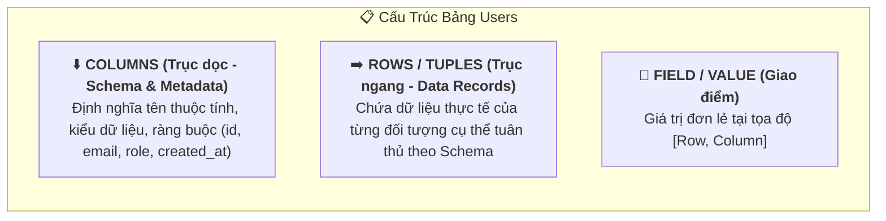

# 📊 Rows & Columns in PostgreSQL (Hàng & Cột)

> 💡 **Core Definitions:**
>
> - **Rows in PostgreSQL:**  
>   *A row in PostgreSQL represents a single, uniquely identifiable record with a specific set of fields in a table. Each row in a table is made up of one or more columns, where each column can store a specific type of data (e.g., integer, character, date, etc.). The structure of a table determines the schema of its rows, and each row in a table must adhere to this schema.*
>
> - **Columns in PostgreSQL:**  
>   *Columns are a fundamental component of PostgreSQL's object model. They are used to store the actual data within a table and define their attributes such as data type, constraints, and other properties.*

---

## 1. Mô Hình Bảng 2 Chiều: Trục Cột (Columns) & Trục Hàng (Rows)

Trong cơ sở dữ liệu quan hệ, một **Bảng (Table)** là một ma trận 2 chiều được giao cắt bởi các Cột và các Hàng:



### Minh họa trực quan:
```text
  Columns (Thuộc tính / Schema) ──────►  [ id ]      [ username ]      [ email ]            [ is_active ]
  ───────────────────────────────────────────────────────────────────────────────────────────────────────
  Row 1 (Bản ghi người dùng A)  ───►    101         "alex_nguyen"    "alex@gmail.com"      true
  Row 2 (Bản ghi người dùng B)  ───►    102         "maria_db"       "maria@dev.io"        false
  Row 3 (Bản ghi người dùng C)  ───►    103         "john_doe"       "john@company.com"    true
```

---

## 2. Columns in PostgreSQL (Cột Dữ Liệu)

Cột là thành phần định hình cấu trúc dữ liệu (**Schema**) của bảng. Mỗi cột xác định rõ loại dữ liệu được phép lưu và các quy tắc kiểm tra tính hợp lệ.

### 2.1. Các Kiểu Dữ Liệu Cột Phổ Biến (Data Types)
- **Số nguyên & Số thực:** `INT`, `BIGINT`, `NUMERIC(10, 2)` (chính xác tuyệt đối cho tiền tệ), `DOUBLE PRECISION`.
- **Chuỗi văn bản:** `TEXT` (chuỗi độ dài tùy ý, tối ưu trong Postgres), `VARCHAR(n)` (chuỗi giới hạn ký tự).
- **Thời gian:** `TIMESTAMPTZ` (Timestamp kèm Múi giờ - chuẩn khuyến nghị), `DATE`, `TIME`.
- **Kiểu nâng cao:** `BOOLEAN`, `UUID`, `JSONB`, `TEXT[]` (Mảng).

### 2.2. Ràng Buộc Cột (Column Constraints)
Ràng buộc bảo vệ dữ liệu khỏi việc bị nhập sai hoặc thiếu:

| Ràng Buộc | Ý Nghĩa | Ví Dụ Khai Báo |
| :--- | :--- | :--- |
| **PRIMARY KEY** | Định danh duy nhất cho mỗi hàng (ngầm định `NOT NULL` + `UNIQUE`). | `id BIGINT GENERATED ALWAYS AS IDENTITY PRIMARY KEY` |
| **NOT NULL** | Không cho phép để trống giá trị. | `email VARCHAR(255) NOT NULL` |
| **UNIQUE** | Không cho phép hai hàng có giá trị cột trùng nhau. | `username VARCHAR(50) UNIQUE` |
| **DEFAULT** | Giá trị mặc định khi người dùng không truyền vào. | `created_at TIMESTAMPTZ DEFAULT CURRENT_TIMESTAMP` |
| **CHECK** | Kiểm tra điều kiện logic của giá trị trước khi ghi. | `age INT CHECK (age >= 18)` |
| **REFERENCES** | Khóa ngoại (Foreign Key) tham chiếu tới bảng khác. | `user_id UUID REFERENCES users(id) ON DELETE CASCADE` |

### 2.3. Các Thao Tác Quản Lý Cột (DDL)
```sql
-- Thêm một cột mới vào bảng
ALTER TABLE users ADD COLUMN phone_number VARCHAR(20);

-- Đổi kiểu dữ liệu của cột
ALTER TABLE users ALTER COLUMN phone_number TYPE VARCHAR(30);

-- Đặt giá trị mặc định cho cột
ALTER TABLE users ALTER COLUMN is_active SET DEFAULT TRUE;

-- Đổi tên cột
ALTER TABLE users RENAME COLUMN phone_number TO contact_phone;

-- Xóa cột
ALTER TABLE users DROP COLUMN contact_phone;
```

---

## 3. Rows in PostgreSQL (Hàng / Bản Ghi / Tuple)

Trong kiến trúc nội bộ của PostgreSQL, một hàng thường được gọi là một **Tuple**. Mỗi hàng đại diện cho một thực thể độc lập duy nhất trong đời thực (ví dụ: một tài khoản người dùng, một đơn hàng, một sản phẩm).

### 3.1. Tính Định Danh Duy Nhất (Uniquely Identifiable)
Mỗi row trong một bảng chuẩn luôn cần một khóa chính (**Primary Key**), thường là:
- Số tự tăng (`BIGINT GENERATED ALWAYS AS IDENTITY`).
- Mã định danh toàn cầu (`UUID`).

### 3.2. Các Cột Ẩn Hệ Thống Trên Mỗi Row (System Columns)
PostgreSQL tự động gắn các trường metadata ẩn trên từng hàng để phục vụ việc lưu trữ đĩa và quản lý đồng thời MVCC:
- **`ctid`:** Vị trí vật lý của row trên ổ đĩa theo dạng `(block_number, tuple_index)`.
- **`xmin`:** Mã Transaction ID của transaction đã thực hiện lệnh `INSERT` tạo ra row này.
- **`xmax`:** Mã Transaction ID của transaction đã thực hiện lệnh `UPDATE` hoặc `DELETE` row này.

> 🔍 **Truy vấn xem cột ẩn:**
> ```sql
> SELECT ctid, xmin, xmax, id, username FROM users;
> ```

### 3.3. Các Thao Tác Quản Lý Row (DML)
```sql
-- 1. Thêm một hoặc nhiều hàng mới (INSERT)
INSERT INTO users (username, email) 
VALUES 
  ('alex_nguyen', 'alex@gmail.com'),
  ('maria_db', 'maria@dev.io');

-- 2. Đọc dữ liệu hàng (SELECT)
SELECT * FROM users WHERE id = 1;

-- 3. Cập nhật dữ liệu hàng (UPDATE)
UPDATE users 
SET email = 'new_email@gmail.com', updated_at = CURRENT_TIMESTAMP 
WHERE username = 'alex_nguyen';

-- 4. Xóa hàng (DELETE)
DELETE FROM users WHERE id = 2;
```

### 3.4. Điểm Sáng Postgres: Mệnh đề `RETURNING` & `ON CONFLICT` (UPSERT)
PostgreSQL cung cấp các cú pháp cực mạnh giúp Backend tối ưu tốc độ và giảm số lần gọi network:

```sql
-- Lấy lại ngay ID và thời gian tạo của row vừa INSERT mà không cần SELECT lại:
INSERT INTO users (username, email)
VALUES ('kevin_tech', 'kevin@tech.com')
RETURNING id, created_at;

-- UPSERT: Nếu trùng email thì cập nhật thay vì báo lỗi:
INSERT INTO users (username, email)
VALUES ('kevin_tech', 'kevin@tech.com')
ON CONFLICT (email) 
DO UPDATE SET username = EXCLUDED.username;
```

---

## 4. So Sánh Nhanh: Rows vs Columns

| Tiêu Chí | Columns (Cột) | Rows (Hàng) |
| :--- | :--- | :--- |
| **Thuật ngữ khác** | Field, Attribute, Property | Record, Tuple, Entity |
| **Chiều không gian** | Trục dọc (Vertical) | Trục ngang (Horizontal) |
| **Bản chất** | Định nghĩa **Schema** (cấu trúc, quy tắc, kiểu dữ liệu). | Chứa **Data** thực tế (thể hiện của đối tượng). |
| **Tần suất thay đổi** | Hiếm khi thay đổi (chỉ khi cập nhật tính năng / migration DB). | Thay đổi liên tục theo thời gian thực (hàng triệu lượt INSERT/UPDATE/DELETE). |
| **Ngôn ngữ tác động** | DDL (`CREATE`, `ALTER`, `DROP COLUMN`). | DML (`INSERT`, `SELECT`, `UPDATE`, `DELETE`). |

---

## 5. Best Practices Dành Cho Backend Developer

1. **Chuẩn đặt tên:** Dùng `snake_case` chữ thường cho cả tên bảng và tên cột (VD: `order_items`, `created_at`). Tránh dùng `camelCase` vì Postgres mặc định chuyển tên thành chữ thường trừ khi bọc trong dấu ngoặc kép `"..."`.
2. **Khóa chính:** Luôn khai báo `PRIMARY KEY` cho mọi bảng (ưu tiên `BIGINT IDENTITY` hoặc `UUID`).
3. **Múi giờ:** Luôn chọn `TIMESTAMPTZ` thay vì `TIMESTAMP` để tránh lỗi lệch giờ khi server và database đặt ở các quốc gia khác nhau.
4. **Tối ưu chuỗi:** Ưu tiên dùng `TEXT` thay vì `VARCHAR(255)` tùy tiện, vì trong PostgreSQL hiệu năng lưu trữ của `TEXT` và `VARCHAR` là hoàn toàn ngang nhau.
5. **Giới hạn số cột:** Không nên thiết kế bảng có quá nhiều cột (>50 cột). Nếu có nhiều thuộc tính động hoặc tùy chọn, hãy gom vào một cột kiểu `JSONB`.
