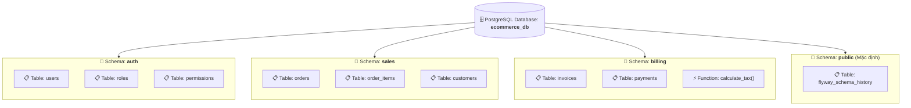

# 📁 Schemas in PostgreSQL

> 💡 **What is a Schema?**  
> **Schemas** are an essential part of PostgreSQL's object model, and they help provide structure, organization, and namespacing for your database objects. A schema is a collection of database objects, such as tables, views, indexes, and functions, that are organized within a specific namespace.

---

## 1. Bản Chất Của Schema: Không Gian Tên (Namespace)

Để dễ hình dung trong thực tế:
- **Database** giống như một **Ổ đĩa** (Drive `C:` hoặc `D:`).
- **Schema** giống như các **Thư mục (Folders)** nằm bên trong ổ đĩa đó.
- **Tables, Views, Functions, Indexes** giống như các **Tệp tin (Files)** được lưu trữ trong từng thư mục.



### Tại sao không tách ra nhiều Database mà lại dùng Schema?
- **Nhiều Database độc lập:** Không thể thực hiện câu lệnh `JOIN` dữ liệu qua lại giữa 2 database trên cùng một kết nối connection pool.
- **Nhiều Schemas trong cùng 1 Database:** Dễ dàng `JOIN` dữ liệu giữa các bảng ở schema khác nhau (ví dụ: `JOIN auth.users ON sales.orders.user_id = auth.users.id`) mà vẫn đảm bảo tính ngăn nắp, bảo mật và phân quyền độc lập.

---

## 2. Schema Mặc Định: `public`

- Mọi Database mới trong PostgreSQL đều được tạo sẵn một schema tên là **`public`**.
- Nếu bạn gõ lệnh tạo bảng mà không chỉ định tên schema phía trước:
  ```sql
  CREATE TABLE products (...);
  ```
  PostgreSQL sẽ ngầm hiểu và tạo bảng tại: **`public.products`**.

> ⚠️ **Lưu ý bảo mật từ PostgreSQL 15+:**  
> Kể từ phiên bản PostgreSQL 15, quyền `CREATE` trên schema `public` đối với người dùng thông thường (`PUBLIC`) đã bị thu hồi để ngăn chặn nguy cơ bảo mật. Các ứng dụng hiện đại được khuyến khích tạo schema riêng cho từng nghiệp vụ hoặc từng tenant.

---

## 3. Cơ Chế Phân Giải Đường Dẫn `search_path`

Khi bạn gõ lệnh `SELECT * FROM users;`, làm thế nào PostgreSQL biết bạn muốn tìm bảng `users` trong schema nào?
-> PostgreSQL sử dụng biến cấu hình **`search_path`** (hoạt động tương tự như biến môi trường `$PATH` của Linux).

```sql
-- Xem đường dẫn tìm kiếm hiện tại
SHOW search_path;
-- Kết quả mặc định thường là: "$user", public
```

### Cách thức hoạt động:
1. Khi có truy vấn không kèm tên schema (`users`), Postgres sẽ duyệt lần lượt từ trái sang phải trong `search_path`.
2. Đầu tiên kiểm tra schema có tên trùng với username đăng nhập hiện tại (`"$user"`).
3. Nếu không có, nó tìm tiếp trong schema `public`.
4. Tìm thấy ở đâu trước, nó sẽ dùng bảng ở schema đó.

### Thay đổi `search_path`:
```sql
-- Thay đổi search_path cho session hiện tại
SET search_path TO sales, auth, public;

-- Giờ đây truy vấn này sẽ tự động tìm bảng trong schema sales trước:
SELECT * FROM orders; 
```

---

## 4. Các Trường Hợp Sử Dụng Thực Tế Của Schema (Use Cases)

| Use Case | Mô Tả Thực Tế | Lợi Ích |
| :--- | :--- | :--- |
| **1. Phân chia Module nghiệp vụ** | Chia hệ thống lớn thành các schema: `auth`, `payment`, `shipping`, `inventory`, `reporting`. | Tránh xung đột tên bảng (VD: `auth.users` vs `chat.users`), code gọn gàng, rõ trách nhiệm. |
| **2. Kiến trúc Multi-tenancy** | Mỗi khách hàng (Tenant doanh nghiệp) sở hữu một schema riêng: `tenant_fpt`, `tenant_viettel`, `tenant_shopee`. | Dùng chung tài nguyên database, giảm chi phí server, cô lập dữ liệu tuyệt đối giữa các khách hàng. |
| **3. Phân quyền bảo mật (RBAC)** | Giới hạn chỉ có phòng kế toán mới được đọc ghi schema `billing`, các developer chỉ được xem `public`. | `GRANT USAGE ON SCHEMA billing TO accountant_role;` |
| **4. Dữ liệu Staging / ETL** | Phân chia dữ liệu theo giai đoạn: `raw_data` $\rightarrow$ `staging` $\rightarrow$ `analytics`. | Thuận tiện cho các pipeline dữ liệu và Data Warehouse. |

---

## 5. Các Lệnh SQL Thao Tác Với Schema (DDL & DCL)

### 5.1. Tạo mới Schema
```sql
-- Tạo schema đơn giản
CREATE SCHEMA sales;

-- Tạo schema an toàn (nếu chưa có) và chỉ định chủ sở hữu (owner)
CREATE SCHEMA IF NOT EXISTS billing AUTHORIZATION app_admin;
```

### 5.2. Tạo Bảng & Đối Tượng bên trong Schema
```sql
-- Cách 1: Chỉ định tiền tố schema.table_name (Khuyên dùng)
CREATE TABLE sales.orders (
    id BIGINT GENERATED ALWAYS AS IDENTITY PRIMARY KEY,
    customer_name VARCHAR(100) NOT NULL,
    total_amount NUMERIC(12, 2) NOT NULL,
    created_at TIMESTAMPTZ DEFAULT CURRENT_TIMESTAMP
);

-- Cách 2: Set search_path rồi tạo bình thường
SET search_path TO sales;
CREATE TABLE order_items (...);
```

### 5.3. Di Chuyển Bảng Giữa Các Schema
```sql
-- Di chuyển một bảng từ schema public sang schema sales
ALTER TABLE public.orders SET SCHEMA sales;
```

### 5.4. Phân Quyền Truy Cập (Security & Permissions)
```sql
-- Cho phép user 'developer' nhìn thấy schema 'sales'
GRANT USAGE ON SCHEMA sales TO developer;

-- Cho phép user 'developer' được SELECT trên tất cả các bảng của schema 'sales'
GRANT SELECT ON ALL TABLES IN SCHEMA sales TO developer;
```

### 5.5. Đổi Tên & Xóa Schema
```sql
-- Đổi tên schema
ALTER SCHEMA sales RENAME TO commercial;

-- Xóa schema rỗng
DROP SCHEMA commercial;

-- Xóa schema cùng toàn bộ tất cả bảng/view bên trong nó (CẨN THẬN!)
DROP SCHEMA commercial CASCADE;
```

---

## 6. Các Phím Tắt Tiện Dụng Trong `psql` CLI

- `\dn` : Liệt kê tất cả các schemas trong database hiện tại.
- `\dn+` : Xem danh sách schemas kèm thông tin Chủ sở hữu (Owner) và Quyền hạn truy cập.
- `\dt sales.*` : Liệt kê toàn bộ các bảng thuộc schema `sales`.
- `\df sales.*` : Liệt kê các hàm (Functions/Stored procedures) thuộc schema `sales`.

---

## 7. Tóm Tắt Nhanh (Key Takeaway)

- **Schema:** Thư mục chứa các đối tượng database (Tables, Views, Functions) giúp tổ chức dự án ngăn nắp theo không gian tên (*Namespace*).
- **Truy cập:** Dùng cú pháp `schema_name.table_name` hoặc điều hướng thông qua biến cấu hình `search_path`.
- **Sức mạnh lớn nhất:** Cho phép chia nhỏ module, triển khai mô hình **Multi-tenancy (Mỗi khách 1 schema)** và phân quyền truy cập chặt chẽ mà vẫn có thể `JOIN` dữ liệu qua lại linh hoạt.
