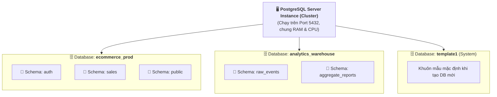

# 🗄️ Databases in PostgreSQL

> 💡 **What is a Database in PostgreSQL?**  
> **In PostgreSQL, a database is a named collection of tables, indexes, views, stored procedures, and other database objects.** Each PostgreSQL server can manage multiple databases, enabling the separation and organization of data sets for various applications, projects, or users.

---

## 1. Bản Chất Của Database Trong PostgreSQL Cluster

Trong kiến trúc của PostgreSQL:
- Khi cài đặt và khởi chạy một tiến trình PostgreSQL Server, bạn đang vận hành một **Database Cluster** (tập hợp các cơ sở dữ liệu được quản lý bởi cùng một server instance và lưu chung một thư mục dữ liệu trên đĩa).
- Bên trong một Server Cluster, bạn có thể tạo **nhiều Database độc lập** hoàn toàn với nhau (`ecommerce_db`, `crm_db`, `blog_db`).



### Đặc tính cô lập tuyệt đối (Strict Isolation):
- Mỗi kết nối (Connection) từ ứng dụng Backend chỉ được kết nối vào **đúng một Database tại một thời điểm**.
- Người dùng ở `Database A` **không thể trực tiếp truy vấn hoặc JOIN dữ liệu** sang `Database B` qua câu lệnh SQL thông thường (muốn làm vậy phải dùng extension trung gian như `postgres_fdw`).

---

## 2. Các Database Mặc Định Của Hệ Thống

Khi bạn vừa cài đặt PostgreSQL xong, hệ thống đã tạo sẵn 3 database đặc biệt:

| Database | Mục Đích Sử Dụng |
| :--- | :--- |
| **`postgres`** | Database tiện ích mặc định dành cho Admin/DBA đăng nhập ban đầu để cấu hình hệ thống, tạo user và tạo các database ứng dụng khác. Không nên lưu bảng nghiệp vụ vào đây. |
| **`template1`** | Database khuôn mẫu gốc (*Template*). Khi bạn chạy lệnh `CREATE DATABASE app_db;`, PostgreSQL thực chất sẽ tạo một bản sao y hệt từ `template1`. |
| **`template0`** | Bản sao khuôn mẫu nguyên bản sạch của nhà sản xuất, ở chế độ chỉ đọc (*Read-only*), dùng để khôi phục lại `template1` nếu bạn lỡ cấu hình sai. |

---

## 3. Phân Biệt: Database vs Schema (Khi Nào Dùng Gì?)

Rất nhiều lập trình viên mới bắt đầu thường phân vân giữa việc tách Database hay tách Schema:

| Tiêu Chí | Database | Schema |
| :--- | :--- | :--- |
| **Cấp bậc** | Nằm trực tiếp dưới Server Cluster. | Nằm bên trong một Database. |
| **Mức độ cô lập** | **Tuyệt đối**. Hoàn toàn độc lập về dữ liệu và phiên kết nối. | **Tương đối**. Vẫn dùng chung không gian transaction và kết nối của DB. |
| **Khả năng JOIN** | **KHÔNG** hỗ trợ JOIN trực tiếp giữa các Database. | **CÓ**. Hỗ trợ `JOIN` và tạo `FOREIGN KEY` dễ dàng qua `schema.table`. |
| **Connection Pool** | Mỗi connection pool của Backend chỉ trỏ vào 1 Database duy nhất. | 1 connection pool có thể truy cập mọi schema (nếu có quyền). |
| **Khi nào nên dùng?** | • Các ứng dụng hoàn toàn tách biệt (App Bán hàng vs App Chấm công).<br>• Tách môi trường: `app_dev`, `app_test`, `app_prod`. | • Các module trong cùng 1 ứng dụng (`auth`, `billing`, `inventory`).<br>• Hệ thống SaaS Multi-tenant dùng chung DB. |

---

## 4. Các Câu Lệnh SQL Quản Trị Database (DDL)

### 4.1. Tạo mới Database
```sql
-- Tạo database cơ bản
CREATE DATABASE ecommerce_db;

-- Tạo database chuẩn chỉnh cho Production (chỉ định Owner, Bảng mã UTF-8)
CREATE DATABASE ecommerce_db
WITH 
    OWNER = app_user
    ENCODING = 'UTF8'
    LC_COLLATE = 'en_US.UTF-8'
    LC_CTYPE = 'en_US.UTF-8'
    TEMPLATE = template1;
```

### 4.2. Đổi tên & Sửa thông tin Database
```sql
-- Đổi tên database (yêu cầu không có ai đang kết nối vào DB này)
ALTER DATABASE ecommerce_db RENAME TO shop_db;

-- Đổi chủ sở hữu (Owner) của database
ALTER DATABASE shop_db OWNER TO new_admin;
```

### 4.3. Xóa Database
```sql
-- Xóa database rỗng/không có kết nối
DROP DATABASE IF EXISTS shop_db;

-- [Từ PostgreSQL 13+] Ép buộc ngắt tất cả kết nối đang hoạt động và xóa ngay:
DROP DATABASE shop_db WITH (FORCE);
```

---

## 5. Thao Tác Nhanh Với CLI (`psql` & Terminal)

### 5.1. Phím tắt trong `psql`:
- `\l` : Liệt kê tất cả các databases trong cluster hiện tại.
- `\l+` : Xem danh sách database kèm dung lượng đĩa (*Size*), Bảng mã (*Encoding*), và Mô tả.
- `\c <dbname>` : Chuyển phiên làm việc sang kết nối với database `<dbname>`.

### 5.2. Các lệnh Command-Line ngoài Terminal (Shell):
```bash
# Tạo nhanh một database từ Terminal không cần vào psql
createdb -U postgres -h localhost ecommerce_db

# Xóa một database từ Terminal
dropdb -U postgres -h localhost ecommerce_db

# Sao lưu (Backup) toàn bộ một database ra file .sql
pg_dump -U postgres -d ecommerce_db > backup_ecommerce.sql

# Phục hồi (Restore) dữ liệu từ file backup vào database mới
psql -U postgres -d ecommerce_db < backup_ecommerce.sql
```

---

## 6. Tóm Tắt Nhanh (Key Takeaway)

- **Database:** Khối chứa dữ liệu lớn nhất trong một PostgreSQL server, hoàn toàn độc lập và cô lập với các database khác.
- **Quy tắc vàng:**
  - Cần chia các hệ thống/dự án **hoàn toàn khác nhau** hoặc chia môi trường (`dev`/`prod`) $\rightarrow$ Dùng **Database riêng**.
  - Cần chia các module **cùng trong 1 ứng dụng** để có thể `JOIN` dữ liệu $\rightarrow$ Dùng **Schema riêng**.
