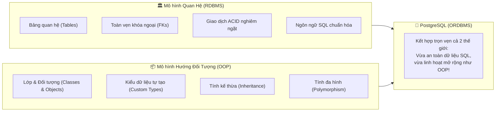
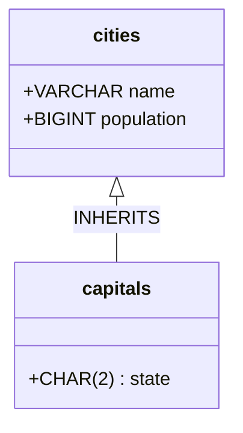

# 🧩 Object Model in PostgreSQL (Mô Hình Đối Tượng)

> 💡 **What is PostgreSQL's Object Model?**  
> **PostgreSQL is an object-relational database management system (ORDBMS).** That means it combines features of both **relational (RDBMS)** and **object-oriented databases (OODBMS)**. The object model in PostgreSQL provides features like **user-defined data types**, **inheritance**, and **polymorphism**, which enhances its capabilities beyond a typical SQL-based RDBMS.

---

## 1. Bản Chất ORDBMS: Sự Giao Thoa Giữa SQL & OOP

Trong khi các hệ quản trị CSDL truyền thống (như MySQL sơ khai) chỉ thuần túy quản lý các bảng dữ liệu dạng phẳng với các kiểu dữ liệu nguyên thủy cố định (`INT`, `VARCHAR`, `DATE`), PostgreSQL ngay từ ban đầu được thiết kế theo tư duy **Hướng đối tượng (Object-Oriented)**:



---

## 2. 3 Trụ Cột Sức Mạnh Của PostgreSQL Object Model

### 2.1. User-Defined Data Types (Kiểu Dữ Liệu Tự Định Nghĩa)
PostgreSQL cho phép lập trình viên tự tạo ra các kiểu dữ liệu mới phức tạp tương tự như cách bạn tạo `class` hoặc `struct` trong ngôn ngữ lập trình (Java/C++):

#### a. Composite Types (Kiểu phức hợp):
Gom nhiều thuộc tính liên quan lại thành một kiểu dữ liệu duy nhất và dùng nó làm kiểu dữ liệu cho một cột:
```sql
-- Định nghĩa kiểu dữ liệu 'address_type' gồm 3 trường
CREATE TYPE address_type AS (
    street VARCHAR(100),
    city VARCHAR(50),
    postal_code VARCHAR(10)
);

-- Sử dụng kiểu 'address_type' làm cột trong bảng Users:
CREATE TABLE companies (
    id BIGINT GENERATED ALWAYS AS IDENTITY PRIMARY KEY,
    name VARCHAR(100) NOT NULL,
    headquarters address_type -- Cột chứa cả địa chỉ phức hợp
);

-- Thêm dữ liệu:
INSERT INTO companies (name, headquarters) 
VALUES ('Google VN', ROW('Duy Tan Street', 'Ha Noi', '100000'));

-- Truy vấn từng trường con của kiểu dữ liệu:
SELECT name, (headquarters).city FROM companies;
```

#### b. Enumerated Types (Kiểu Liệt Kê - ENUM):
Tạo tập hợp các giá trị cố định, an toàn kiểu dữ liệu và tiết kiệm dung lượng đĩa:
```sql
-- Tạo kiểu ENUM trạng thái đơn hàng
CREATE TYPE order_status AS ENUM ('PENDING', 'PROCESSING', 'SHIPPED', 'DELIVERED', 'CANCELLED');

CREATE TABLE orders (
    id BIGINT PRIMARY KEY,
    status order_status DEFAULT 'PENDING'
);
```

---

### 2.2. Table Inheritance (Tính Kế Thừa Bảng)
PostgreSQL là một trong số rất ít cơ sở dữ liệu hỗ trợ **kế thừa bảng** bằng từ khóa `INHERITS`. Bảng con sẽ tự động kế thừa toàn bộ các cột và kiểu dữ liệu từ bảng cha, đồng thời có thể thêm các cột riêng của mình:



#### Code SQL minh họa:
```sql
-- 1. Bảng cha: cities
CREATE TABLE cities (
    name VARCHAR(50) NOT NULL,
    population BIGINT
);

-- 2. Bảng con: capitals kế thừa từ bảng cities
CREATE TABLE capitals (
    state CHAR(2) NOT NULL
) INHERITS (cities);

-- 3. Chèn dữ liệu vào bảng cha và bảng con
INSERT INTO cities VALUES ('Da Nang', 1200000);
INSERT INTO capitals VALUES ('Ha Noi', 8500000, 'HN');

-- 4. ĐẶC TÍNH ĐA HÌNH: Truy vấn bảng cha 'cities' sẽ thấy cả dữ liệu của 'capitals'!
SELECT * FROM cities;
-- Kết quả gồm cả:
--   Da Nang  | 1200000
--   Ha Noi   | 8500000

-- Nếu CHỈ muốn lấy dữ liệu của riêng bảng cha, dùng từ khóa ONLY:
SELECT * FROM ONLY cities;
```

---

### 2.3. Polymorphism & Function Overloading (Đa Hình & Nạp Chồng Hàm)
Tương tự như ngôn ngữ Backend (Java, C#), PostgreSQL cho phép bạn viết **nhiều hàm cùng tên nhưng khác kiểu dữ liệu tham số** (Function Overloading):

```sql
-- Hàm tính thuế cho khách hàng cá nhân (truyền vào số tiền)
CREATE OR REPLACE FUNCTION calculate_tax(amount NUMERIC) 
RETURNS NUMERIC AS $$
BEGIN
    RETURN amount * 0.10; -- 10% VAT
END;
$$ LANGUAGE plpgsql;

-- Nạp chồng hàm: Cùng tên 'calculate_tax' nhưng nhận thêm mã quốc gia
CREATE OR REPLACE FUNCTION calculate_tax(amount NUMERIC, country_code VARCHAR) 
RETURNS NUMERIC AS $$
BEGIN
    IF country_code = 'US' THEN
        RETURN amount * 0.08;
    ELSE
        RETURN amount * 0.10;
    END IF;
END;
$$ LANGUAGE plpgsql;
```
> Ngoài ra, Postgres hỗ trợ các kiểu tham số đa hình tổng quát (**Polymorphic Pseudotypes**) như `anyelement`, `anyarray` cho phép viết 1 hàm duy nhất dùng được cho mọi kiểu dữ liệu (tương tự như Java Generics).

---

## 3. Ứng Dụng Thực Tế & Lời Khuyên Cho Backend Developer

| Tính Năng Object Model | Khi Nào Nên Dùng? | Cần Cân Nhắc / Lưu Ý |
| :--- | :--- | :--- |
| **Custom ENUMs** | Trạng thái đơn hàng, phân quyền (`ROLE_ADMIN`, `ROLE_USER`). | Rất tốt. Tối ưu hơn `VARCHAR` và an toàn kiểu dữ liệu hơn `INT`. |
| **Composite Types** | Cấu trúc dữ liệu cố định (Địa chỉ, Tọa độ Lat-Lng). | Nếu dữ liệu thay đổi linh hoạt theo thời gian, ưu tiên dùng **`JSONB`**. |
| **Table Inheritance** | Phân loại danh mục dữ liệu, kế thừa cấu trúc chung. | ⚠️ **Cẩn trọng:** Ràng buộc `UNIQUE` và `FOREIGN KEY` không tự động áp dụng xuyên suốt giữa bảng cha và con. Để phân vùng bảng lớn (Time-series data), ngày nay người ta dùng **Declarative Partitioning** (`PARTITION BY`) thay vì raw inheritance. |
| **Function Overloading** | Xây dựng Stored Procedures và các thư viện hàm nghiệp vụ nội bộ DB. | Đặt tên rõ ràng để tránh nhầm lẫn khi debug. |

---

## 4. Tóm Tắt Nhanh (Key Takeaway)

- **ORDBMS:** PostgreSQL kết hợp sức mạnh bảo mật, giao dịch ACID của **Relational SQL** với tính linh hoạt của **Lập trình hướng đối tượng**.
- **Bộ 3 Object Model:**
  1. **Custom Types:** Tự do tạo kiểu phức hợp (`Composite`) và kiểu liệt kê (`ENUM`).
  2. **Inheritance:** Kế thừa bảng (`INHERITS`), bảng con thừa hưởng toàn bộ schema của bảng cha.
  3. **Polymorphism:** Nạp chồng hàm (*Function Overloading*) và hàm xử lý đa hình (*Generics*).
