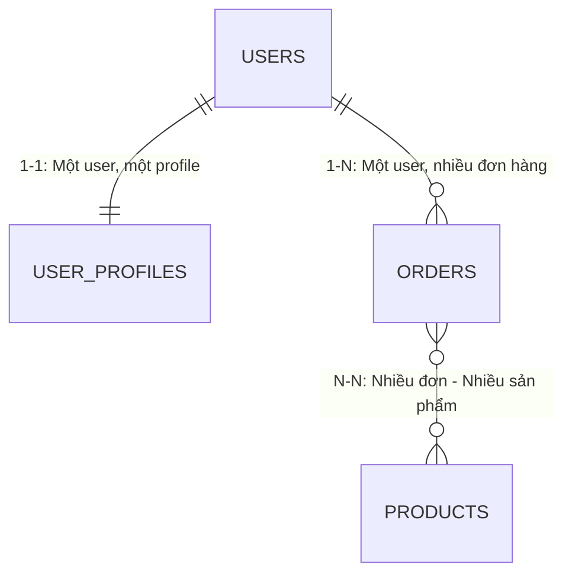

# 🔗 Relational Model (Mô Hình Dữ Liệu Quan Hệ)

Mô hình quan hệ (**Relational Model**) là cách tổ chức dữ liệu dưới dạng **bảng (Tables)** — do **Edgar F. Codd** đề xuất năm 1970 tại IBM. Đây là nền tảng lý thuyết của mọi RDBMS hiện đại, bao gồm PostgreSQL.

---

## 1. Các Thành Phần Cốt Lõi

| Thuật Ngữ (Codd) | Trong SQL | Ý Nghĩa |
| :--- | :--- | :--- |
| **Relation** | Table | Bảng dữ liệu. |
| **Tuple** | Row / Record | Một bản ghi. |
| **Attribute** | Column / Field | Một thuộc tính dữ liệu. |
| **Domain** | Data Type | Tập hợp giá trị hợp lệ của một cột (`INT`, `TEXT`, `DATE`...). |
| **Constraints** | Constraints | Quy tắc bảo vệ tính toàn vẹn dữ liệu (`NOT NULL`, `UNIQUE`, `FK`...). |
| **NULL** | NULL | Giá trị đặc biệt — *chưa biết / không có dữ liệu* (khác với `0` hay `''`). |

---

## 2. Ràng Buộc Toàn Vẹn (3 Loại Chính)

- **Entity Integrity (Thực thể):** `PRIMARY KEY` — định danh duy nhất mỗi hàng, không bao giờ `NULL`.
- **Referential Integrity (Tham chiếu):** `FOREIGN KEY` — liên kết giữa các bảng, không tồn tại bản ghi con trỏ tới bản ghi cha không có thực.
- **Domain Integrity (Miền giá trị):** Kiểu dữ liệu + `CHECK` — đảm bảo dữ liệu nhập vào đúng định dạng và hợp lệ.

---

## 3. Các Loại Quan Hệ Giữa Bảng



- **1-1:** Tách thông tin nhạy cảm / ít dùng ra bảng riêng.
- **1-N:** Phổ biến nhất — đặt cột `FK` vào bảng con.
- **N-N:** Bắt buộc dùng **bảng trung gian (Junction Table)**, VD: `order_items(order_id, product_id)`.

---

## 4. NULL — Một Điểm Đặc Biệt Cần Nhớ

- `NULL` **≠** số `0`, **≠** chuỗi rỗng `''`.
- `NULL` nghĩa là **"không biết"** — mọi phép so sánh với `NULL` đều trả về `NULL` (không phải `TRUE` hay `FALSE`).
- Kiểm tra NULL phải dùng `IS NULL` / `IS NOT NULL`, **không dùng** `= NULL`.

```sql
-- ❌ Sai: Không bao giờ trả về kết quả như mong đợi
SELECT * FROM users WHERE phone = NULL;

-- ✅ Đúng:
SELECT * FROM users WHERE phone IS NULL;
```

---

## 5. Tóm Tắt

- **Dữ liệu = Bảng (Relations)** gồm Hàng (Tuples) và Cột (Attributes).
- **Ràng buộc toàn vẹn** = `PK` + `FK` + `CHECK/NOT NULL` — bộ 3 bảo vệ chất lượng dữ liệu.
- **Mối quan hệ** = 1-1 / 1-N / N-N, được thể hiện qua `FOREIGN KEY` và bảng trung gian.
- **NULL** = "Không biết", không phải 0 hay rỗng.
