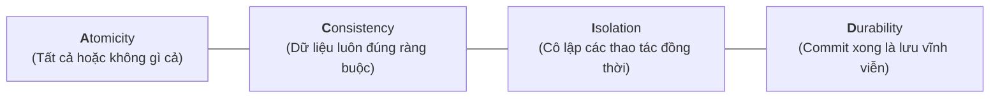
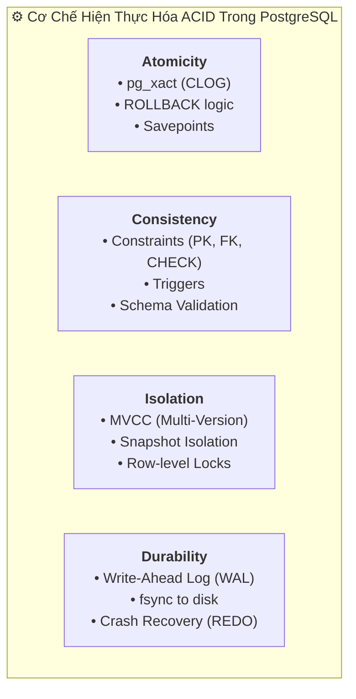

# 🛡️ ACID Properties in PostgreSQL (Bộ 4 Tính Chất Vàng Của Giao Dịch)

> 💡 **Khái niệm:**  
> **ACID** là viết tắt của 4 tính chất bắt buộc: **Atomicity (Nguyên tử)**, **Consistency (Nhất quán)**, **Isolation (Cô lập)**, và **Durability (Bền vững)**. Đây là bộ tiêu chuẩn vàng đảm bảo mọi giao dịch trong hệ thống cơ sở dữ liệu quan hệ (RDBMS) luôn **chính xác, tin cậy và không bao giờ mất dữ liệu**, ngay cả khi gặp lỗi phần mềm hay sự cố sập nguồn.

---

## 1. Bản Chất Của ACID Trong Hệ Thống Backend

Trong các hệ thống phân tán và ứng dụng Backend (ngân hàng, ví điện tử, sàn thương mại điện tử), nhiều thao tác kinh doanh không thể diễn ra độc lập:
- Ví dụ: Khi User A chuyển 500.000đ cho User B, hệ thống phải thực hiện 2 lệnh:
  1. Trừ 500.000đ ở tài khoản A.
  2. Cộng 500.000đ ở tài khoản B.
- Nếu không có ACID, chỉ cần server mất điện ở giữa 2 câu lệnh, tiền của A sẽ bốc hơi trong khi B chưa nhận được. ACID sinh ra để triệt tiêu hoàn toàn rủi ro này.



---

## 2. Chi Tiết Từng Tính Chất Trong PostgreSQL

### 2.1. 🅰️ Atomicity (Tính Nguyên Tử — "All or Nothing")

#### Ý nghĩa:
Một giao dịch là một khối thống nhất không thể chia cắt. Toàn bộ các câu lệnh bên trong giao dịch phải:
- **Thành công 100%:** Dữ liệu mới được áp dụng.
- **Hoặc nếu có bất kỳ bước nào lỗi:** Toàn bộ các bước trước đó đều bị hoàn tác (`ROLLBACK`), đưa database về trạng thái ban đầu như chưa từng có gì xảy ra.

#### Cách PostgreSQL hiện thực:
- **CLOG / pg_xact (Transaction Status Log):** PostgreSQL lưu trạng thái của từng transaction (In-progress, Committed, Aborted).
- Nếu transaction bị ngắt quãng do lỗi hoặc lệnh `ROLLBACK`, Postgres đánh dấu transaction là `Aborted`. Các dòng dữ liệu do transaction này tạo ra sẽ bị coi như "vô hình" đối với các transaction khác.
- **Savepoints:** Hỗ trợ rollback cục bộ từng phần:
  ```sql
  BEGIN;
    UPDATE accounts SET balance = balance - 100 WHERE id = 1;
    SAVEPOINT step_one;
    UPDATE accounts SET balance = balance + 100 WHERE id = 99999; -- Tài khoản không tồn tại
    -- Lỗi xảy ra -> chỉ rollback về step_one
    ROLLBACK TO step_one;
  COMMIT;
  ```

---

### 2.2. 🅲 Consistency (Tính Nhất Quán)

#### Ý nghĩa:
Dữ liệu trước và sau khi thực hiện giao dịch phải luôn **thỏa mãn tất cả các quy tắc nghiệp vụ và ràng buộc toàn vẹn** đã định nghĩa trước trong schema.
- Không thể có chuyện tài khoản có số dư âm nếu có ràng buộc `balance >= 0`.
- Không thể có đơn hàng tham chiếu tới một user không tồn tại (`FOREIGN KEY`).

#### Cách PostgreSQL hiện thực:
PostgreSQL bảo vệ tính nhất quán bằng hệ thống ràng buộc cấp hệ thống cực kỳ nghiêm ngặt:
1. **Schema Constraints:** `PRIMARY KEY`, `FOREIGN KEY`, `UNIQUE`, `NOT NULL`, `CHECK (balance >= 0)`.
2. **Triggers:** Các hàm kiểm tra nghiệp vụ phức tạp trước/sau khi thay đổi dữ liệu.
3. **Deferrable Constraints:** Cho phép hoãn kiểm tra ràng buộc cho tới khi `COMMIT`:
   ```sql
   ALTER TABLE orders ADD CONSTRAINT fk_user 
     FOREIGN KEY (user_id) REFERENCES users(id) 
     DEFERRABLE INITIALLY DEFERRED;
   ```

---

### 2.3. 🅸 Isolation (Tính Cô Lập)

#### Ý nghĩa:
Khi có **hàng nghìn người dùng cùng đọc/ghi đồng thời**, kết quả thực thi của một giao dịch phải độc lập, không bị can thiệp và không nhìn thấy dữ liệu trung gian (chưa commit) của giao dịch khác.

#### 4 Cấp độ cô lập (Isolation Levels) theo chuẩn SQL:

| Cấp độ Cô Lập | Dirty Read<br>*(Đọc dữ liệu chưa commit)* | Non-repeatable Read<br>*(Đọc 2 lần thấy giá trị khác nhau)* | Phantom Read<br>*(Đọc 2 lần thấy số lượng dòng thay đổi)* | Serialization Anomaly<br>*(Xung đột logic song song)* |
| :--- | :---: | :---: | :---: | :---: |
| **Read Uncommitted** | ❌ Không bị *(Trong Postgres)* | Có thể bị | Có thể bị | Có thể bị |
| **Read Committed** *(Mặc định)* | ❌ Ngăn chặn | Có thể bị | Có thể bị | Có thể bị |
| **Repeatable Read** | ❌ Ngăn chặn | ❌ Ngăn chặn | ❌ Ngăn chặn *(Trong Postgres)* | Có thể bị |
| **Serializable** | ❌ Ngăn chặn | ❌ Ngăn chặn | ❌ Ngăn chặn | ❌ Ngăn chặn |

> 📌 **Đặc thù PostgreSQL:**
> - PostgreSQL **không hỗ trợ Dirty Read**. Mức `Read Uncommitted` trong Postgres được tự động đối xử như `Read Committed`.
> - PostgreSQL sử dụng **MVCC (Multi-Version Concurrency Control)** và cơ chế **SSI (Serializable Snapshot Isolation)** để đảm bảo tính cô lập mà không cần khóa chết toàn bộ bảng.

---

### 2.4. 🅳 Durability (Tính Bền Vững)

#### Ý nghĩa:
Một khi hệ thống phản hồi `COMMIT` thành công tới client, dữ liệu đã được lưu trữ vĩnh viễn. Dù ngay sau đó **1 mili-giây server bị rút nguồn điện đột ngột hoặc hệ điều hành bị sập**, dữ liệu vẫn không bao giờ bị mất hay sai lệch.

#### Cách PostgreSQL hiện thực:
- **Write-Ahead Log (WAL):** Trước khi dữ liệu thực tế được ghi vào các tệp dữ liệu trên đĩa (Data Pages), thay đổi bắt buộc phải được ghi vào file log WAL trước.
- **Lệnh `fsync`:** Postgres gọi system call `fsync()` để ép hệ điều hành đẩy dữ liệu từ cache phần cứng xuống hẳn phiến đĩa vật lý trước khi trả về `COMMIT`.
- **Crash Recovery:** Khi khởi động lại sau sự cố sập nguồn, Postgres tự động đọc WAL từ điểm Checkpoint gần nhất và thực hiện **REDO** lại tất cả các giao dịch đã commit.

---

## 3. Tổng Kết Kiến Trúc Thực Thi ACID Trong PostgreSQL



### 💡 Lời khuyên thiết kế cho Backend Developer:
1. **Luôn dùng Constraints trong DB:** Đừng chỉ kiểm tra validation ở code backend, hãy cài đặt `NOT NULL`, `CHECK`, `FOREIGN KEY` trực tiếp trong Postgres để đảm bảo chữ **C (Consistency)** tuyệt đối.
2. **Chọn đúng Isolation Level:** 95% trường hợp `Read Committed` (mặc định) là đủ. Chỉ nâng lên `Repeatable Read` hoặc `Serializable` khi xử lý các nghiệp vụ cực kỳ nhạy cảm như kết toán số dư tài chính hoặc trừ tồn kho flash sale.
3. **Cân nhắc `synchronous_commit`:** Nếu có những bảng ghi log/telemetry không quá quan trọng, có thể set `synchronous_commit = off` để tăng tốc độ ghi gấp nhiều lần mà chỉ hy sinh một chút tính Durability cho phiên làm việc đó.
