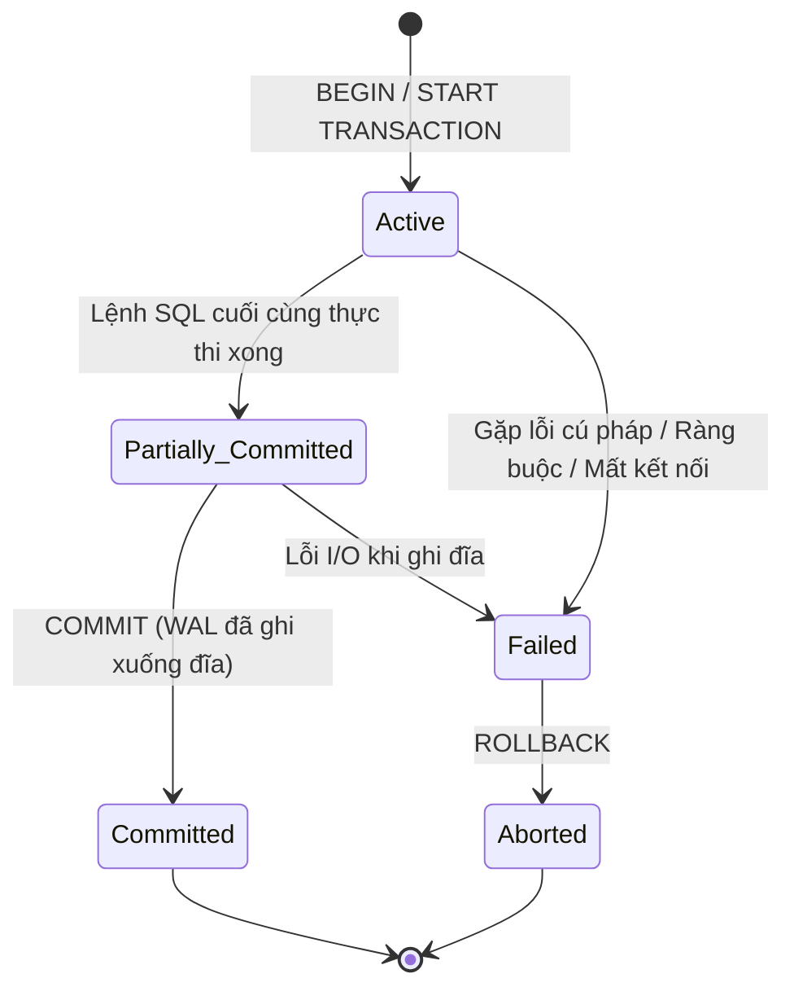

# 📦 Transactions in PostgreSQL (Giao Dịch Cơ Sở Dữ Liệu)

> 💡 **Khái niệm:**  
> **Transaction (Giao dịch)** là một **đơn vị công việc logic (Logical Unit of Work)** bao gồm một hoặc nhiều câu lệnh SQL được nhóm lại và thực thi như một khối duy nhất. Transaction đảm bảo tính toàn vẹn dữ liệu theo nguyên tắc: **Hoặc toàn bộ thành công và được ghi nhận vĩnh viễn, hoặc nếu xảy ra lỗi thì toàn bộ đều bị hủy bỏ (Rollback)**.

---

## 1. Vòng Đời Và Các Trạng Thái Của Transaction

Một giao dịch trong PostgreSQL trải qua các trạng thái tuần tự sau:



1. **Active (Đang thực thi):** Trạng thái ngay sau khi mở `BEGIN`. Transaction đang thực thi các câu lệnh SQL.
2. **Partially Committed (Đã thực thi xong logic):** Tất cả các câu lệnh đã chạy xong trong bộ nhớ, chuẩn bị ghi nhận.
3. **Committed (Đã xác nhận):** Lệnh `COMMIT` thành công, dữ liệu đã được ghi vào WAL và có hiệu lực vĩnh viễn.
4. **Failed (Thất bại):** Một câu lệnh vi phạm ràng buộc (`FOREIGN KEY`, `CHECK`) hoặc server gặp sự cố.
5. **Aborted (Đã hủy bỏ):** Lệnh `ROLLBACK` được gọi, CSDL hoàn tác mọi thay đổi về trạng thái trước khi có transaction.

---

## 2. Các Lệnh Điều Khiển Giao Dịch Trong SQL

### 2.1. Cú pháp cơ bản

```sql
-- 1. Bắt đầu giao dịch
BEGIN; -- hoặc START TRANSACTION;

  -- 2. Thao tác nghiệp vụ 1: Trừ tiền người gửi
  UPDATE accounts 
  SET balance = balance - 200000 
  WHERE user_id = 101 AND balance >= 200000;

  -- 3. Thao tác nghiệp vụ 2: Cộng tiền người nhận
  UPDATE accounts 
  SET balance = balance + 200000 
  WHERE user_id = 202;

  -- 4. Thao tác nghiệp vụ 3: Ghi lịch sử chuyển tiền
  INSERT INTO transfer_logs (sender_id, receiver_id, amount, created_at)
  VALUES (101, 202, 200000, NOW());

-- 5. Xác nhận thành công toàn bộ
COMMIT; -- hoặc END;
```

Nếu bất kỳ thao tác nào ở trên thất bại (ví dụ: `sender_id` không đủ số dư):
```sql
ROLLBACK; -- hoặc ABORT;
```

---

### 2.2. Savepoints (Điểm Lưu Cục Bộ)

Savepoint cho phép lập trình viên **rollback một phần** transaction mà không cần hủy bỏ toàn bộ các công việc đã làm trước đó:

```sql
BEGIN;
  INSERT INTO orders (id, customer_id, total) VALUES (1, 10, 500);

  -- Đặt mốc lưu số 1
  SAVEPOINT my_savepoint;

  -- Thử thực hiện thao tác có nguy cơ lỗi
  INSERT INTO order_items (order_id, product_id, quantity) VALUES (1, 9999, 1);
  -- Nếu sản phẩm 9999 không tồn tại -> Lỗi!

  -- Hoàn tác về đúng mốc savepoint (đơn hàng cha vẫn còn)
  ROLLBACK TO SAVEPOINT my_savepoint;

  -- Thực hiện phương án thay thế
  INSERT INTO order_items (order_id, product_id, quantity) VALUES (1, 1001, 1);

  -- Xóa mốc lưu khi không cần nữa (giải phóng tài nguyên)
  RELEASE SAVEPOINT my_savepoint;

COMMIT;
```

---

## 3. Autocommit Mode vs Explicit Transactions

Trong PostgreSQL:
- **Explicit Transaction (Rõ ràng):** Bạn chủ động gõ `BEGIN` ... `COMMIT`/`ROLLBACK`. Toàn bộ các câu lệnh bên trong được gói gọn thành một khối duy nhất.
- **Implicit / Autocommit Mode (Mặc định):** Nếu bạn chạy một câu lệnh độc lập (`INSERT`, `UPDATE`, `DELETE`) mà không có `BEGIN`, PostgreSQL **tự động bọc câu lệnh đó vào một transaction và tự động `COMMIT` ngay lập tức**.

---

## 4. Thiết Lập Transaction Isolation Level

Bạn có thể cấu hình mức độ cô lập riêng cho từng transaction tùy vào độ nhạy cảm của dữ liệu:

```sql
BEGIN TRANSACTION ISOLATION LEVEL REPEATABLE READ;
  -- Các câu lệnh đọc/ghi với snapshot nhất quán
COMMIT;
```

Hoặc thiết lập mức độ chỉ đọc (**Read-Only**) để bảo vệ dữ liệu và tối ưu hiệu năng:
```sql
BEGIN TRANSACTION READ ONLY;
  SELECT * FROM financial_reports WHERE year = 2026;
COMMIT;
```

---

## 5. Các Vấn Đề Cần Tránh Khi Dùng Transaction Trong Backend

### ⚠️ 1. Long-running Transactions (Giao dịch chạy quá lâu)
**Nguyên nhân:** Lập trình viên gọi API bên ngoài (gửi mail, gọi Stripe, AI API...) bên trong khối transaction của DB:
```javascript
// ❌ BAD PRACTICE: Giữ kết nối DB mở quá lâu
await db.query("BEGIN");
await db.query("UPDATE orders SET status = 'PROCESSING' WHERE id = 1");
await callExternalPaymentGateway(); // Tốn 3 - 10 giây!
await db.query("COMMIT");
```
**Hậu quả:**
- Giữ Row Locks lâu $\to$ Các request khác phải xếp hàng chờ $\to$ Nghẽn connection pool.
- Ngăn cản tiến trình `VACUUM` dọn rác $\to$ Làm bảng bị phình to (**Table Bloat**).

> 💡 **Best Practice:** Chỉ giữ Transaction trong phạm vi thuần túy thao tác DB. Gọi API bên thứ 3 **trước hoặc sau** transaction.

### ⚠️ 2. Deadlocks (Khóa chết giữa 2 transaction)
Xảy ra khi 2 transaction cập nhật các tài nguyên theo thứ tự ngược nhau:
- Tx1: Khóa User A $\to$ Chờ khóa User B.
- Tx2: Khóa User B $\to$ Chờ khóa User A.
PostgreSQL có cơ chế phát hiện deadlock tự động (`deadlock_timeout`, mặc định 1s) và sẽ chủ động hủy một trong hai transaction.
> 💡 **Khắc phục:** Luôn cập nhật các tài nguyên theo một **thứ tự nhất quán** (ví dụ: sắp xếp tăng dần theo `id`).
