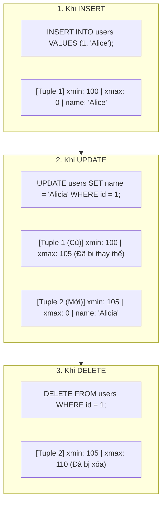

# ⚡ Multi-Version Concurrency Control (MVCC) in PostgreSQL

> 💡 **Khái niệm:**  
> **MVCC (Kiểm Soát Truy Cập Đồng Thời Bằng Đa Phiên Bản)** là kỹ thuật cốt lõi giúp PostgreSQL xử lý đồng thời hàng nghìn kết nối đọc và ghi cùng lúc mà **không làm nghẽn hệ thống**.  
> Triết lý kinh điển của MVCC là:  
> **"Đọc không bao giờ chặn Ghi, và Ghi không bao giờ chặn Đọc"** *(Readers never block Writers, Writers never block Readers)*.

---

## 1. Tại Sao Lại Cần MVCC?

### Cách tiếp cận truyền thống (Lock-based Concurrency):
Trong các database cổ điển (sử dụng giải thuật 2-Phase Locking):
- Khi Transaction A đang **ghi/sửa** một dòng dữ liệu $\to$ Dòng đó bị khóa cứng (Exclusive Lock) $\to$ Transaction B muốn **đọc** phải đứng xếp hàng chờ A commit.
- Ngược lại, khi nhiều người đang đọc $\to$ Người muốn sửa cũng bị chặn lại.
- **Hậu quả:** Hệ thống bị thắt cổ chai, độ trễ tăng vọt khi tải cao.

### Giải pháp đột phá của MVCC:
Thay vì dùng khóa để ngăn cản nhau, PostgreSQL duy trì **nhiều phiên bản (versions) của cùng một dòng dữ liệu cùng lúc**:
- Khi có người sửa dữ liệu, Postgres **không ghi đè** lên bản ghi cũ mà tạo ra một **bản sao mới**.
- Người đọc tiếp tục đọc bản ghi cũ (trước khi sửa).
- Người ghi làm việc trên bản ghi mới.
- Cả hai bên đều thực thi trơn tru mà không ai phải chờ ai.

---

## 2. Kiến Trúc Bên Trong: Các Cột Ẩn `xmin` và `xmax`

Mỗi bảng trong PostgreSQL luôn có các cột hệ thống ngầm gắn liền với từng dòng (tuple):

| Cột Ẩn | Ý Nghĩa Kỹ Thuật |
| :--- | :--- |
| **`xmin`** | Transaction ID (XID) của giao dịch đã **tạo ra (INSERT)** dòng dữ liệu này. |
| **`xmax`** | Transaction ID (XID) của giao dịch đã **xóa hoặc thay thế (DELETE/UPDATE)** dòng này. Nếu dòng vẫn đang tồn tại hợp lệ thì `xmax = 0`. |
| **`ctid`** | Tọa độ vật lý của dòng dữ liệu trên đĩa (Block/Page ID, Offset). |

> 🔍 *Bạn có thể xem các cột này bằng lệnh:*
> ```sql
> SELECT xmin, xmax, ctid, id, name FROM users;
> ```

---

## 3. Cách DML Hoạt Động Dưới Cơ Chế MVCC



1. **INSERT:**
   - Tạo một tuple mới.
   - Gán `xmin = CurrentTxID`, `xmax = 0`.
2. **UPDATE (Thực chất là DELETE bản cũ + INSERT bản mới):**
   - Dòng cũ không bị xóa: Gán `xmax = CurrentTxID` của lệnh update.
   - Tạo ra dòng mới: Gán `xmin = CurrentTxID`, `xmax = 0`.
3. **DELETE:**
   - Dữ liệu không biến mất ngay lập tức trên đĩa.
   - Chỉ đơn giản là cập nhật `xmax = CurrentTxID` của lệnh delete.

---

## 4. Snapshot Isolation (Cơ Chế Bức Ảnh Chụp)

Khi một câu truy vấn hoặc transaction bắt đầu, PostgreSQL cấp cho nó một **Snapshot (Bức ảnh chụp trạng thái CSDL)**:
- Snapshot ghi lại danh sách các Transaction ID:
  - Các transaction đã commit trước thời điểm này $\to$ **Dữ liệu hiển thị**.
  - Các transaction đang chạy dở dang (chưa commit) $\to$ **Dữ liệu vô hình**.
  - Các transaction sinh ra sau thời điểm snapshot $\to$ **Dữ liệu vô hình**.

Nhờ Snapshot, dữ liệu trả về cho bạn luôn nhất quán tại một thời điểm, không bị ảnh hưởng bởi những giao dịch đang sửa đổi song song.

---

## 5. Mặt Trái Của MVCC: Dead Tuples & Bệnh Phình Bảng (Table Bloat)

Vì mỗi lần `UPDATE` hoặc `DELETE` đều giữ lại bản ghi cũ trên đĩa:
- Các bản ghi cũ sau khi tất cả các transaction đã kết thúc được gọi là **Dead Tuples (Tuple rác)**.
- Nếu không xử lý, bảng và index sẽ phình to ra (**Table Bloat / Index Bloat**), làm tốn dung lượng đĩa và khiến tốc độ đọc chậm đi rõ rệt.

### Giải pháp: `VACUUM` và `AUTOVACUUM`
PostgreSQL tích hợp sẵn cơ chế dọn rác tự động:
1. **Standard `VACUUM` (hoặc `AUTOVACUUM` chạy ngầm):**
   - Quét qua bảng, đánh dấu các vị trí của dead tuples là "trống".
   - Cho phép các lệnh `INSERT` sau này ghi đè vào khoảng trống đó mà không cần phình thêm file trên đĩa.
   - **Ưu điểm:** Chạy song song không khóa bảng, đọc/ghi vẫn diễn ra bình thường.
2. **`VACUUM FULL`:**
   - Tạo lại toàn bộ bảng vật lý mới tinh và giải phóng dung lượng thừa trả về cho Hệ điều hành.
   - **Cảnh báo:** Khóa độc quyền toàn bảng (`ACCESS EXCLUSIVE LOCK`), mọi người khác đều bị chặn cho đến khi chạy xong.

---

## 6. Transaction ID Wraparound (Sự Cố Tràn Transaction ID)

- PostgreSQL sử dụng số nguyên 32-bit cho Transaction ID $\to$ Tối đa khoảng **2.1 tỷ transactions**.
- Khi đạt đến giới hạn, Transaction ID sẽ bị quay vòng (wraparound) về 0. Nếu không xử lý, database sẽ nhầm lẫn giao dịch trong quá khứ thành giao dịch trong tương lai.
- **Cơ chế Freeze:** Autovacuum sẽ định kỳ "đóng băng" (Freeze) các tuple cũ, gán cờ `frozen` để đánh dấu rằng tuple này đã thuộc về quá khứ vĩnh viễn, từ đó giải phóng dải Transaction ID để tái sử dụng an toàn.
