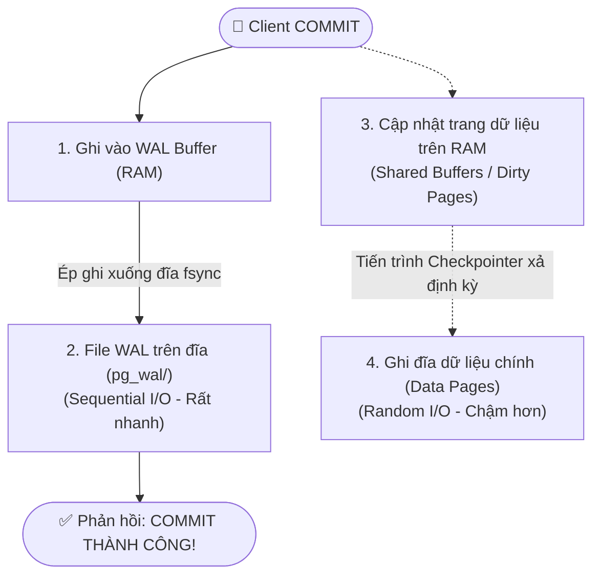

# 📝 Write-Ahead Log (WAL) in PostgreSQL

> 💡 **Khái niệm:**  
> **Write-Ahead Log (WAL - Nhật Ký Ghi Trước)** là cơ chế ghi nhật ký thay đổi trước khi ghi dữ liệu thực tế.  
> Nguyên lý bất di bất dịch của WAL là:  
> **Mọi thay đổi đối với dữ liệu phải được ghi và xả an toàn vào file log (WAL) trên đĩa trước khi các trang dữ liệu thực tế (Data Pages) được ghi xuống đĩa.**

---

## 1. Tại Sao Lại Cần WAL?

### Vấn đề bài toán: Random I/O vs Sequential I/O
- Dữ liệu của một bảng và các chỉ mục (Indexes) nằm rải rác ở nhiều tệp và block khác nhau trên ổ đĩa.
- Nếu mỗi khi User gọi `COMMIT`, database phải tìm đến từng vị trí ngẫu nhiên trên đĩa để ghi dữ liệu (**Random I/O**), ổ đĩa sẽ quá tải và tốc độ xử lý sẽ vô cùng chậm chạp.

### Giải pháp của WAL:
- Ghi vào WAL là hành vi **ghi nối tiếp liên tục vào cuối tệp (Sequential I/O)** — đây là thao tác ghi nhanh nhất mà một ổ đĩa (HDD hay SSD) có thể thực hiện.
- Khi nhận lệnh `COMMIT`, PostgreSQL chỉ cần ghi một đoạn log ngắn mô tả thay đổi vào file WAL và ép ổ đĩa ghi nhận (`fsync`). Sau đó, Postgres **ngay lập tức trả lời client là giao dịch thành công**.
- Dữ liệu thực tế trên bảng sẽ được giữ trên bộ nhớ RAM (Shared Buffers) và ghi xuống đĩa từ từ sau đó.

---

## 2. Vòng Đời Dữ Liệu Với Kiến Trúc WAL

---

## 3. Checkpoint (Điểm Kiểm Tra Định Kỳ)

### Checkpoint là gì?
Nếu server cứ chạy mãi và chỉ ghi vào WAL, file WAL sẽ phình to vô tận và nếu server mất điện, quá trình phục hồi sẽ mất hàng giờ để đọc lại hàng triệu log.  
$\to$ **Checkpoint** là một mốc thời gian mà tiến trình **Checkpointer** ép toàn bộ các trang dữ liệu đang sửa đổi trên RAM (**Dirty Pages**) phải được ghi hoàn tất xuống tệp dữ liệu chính trên đĩa cứng.

### Lợi ích của Checkpoint:
1. **Rút ngắn thời gian phục hồi sau sự cố (Crash Recovery):** Khi khởi động lại, Postgres chỉ cần đọc WAL từ điểm Checkpoint gần nhất trở đi.
2. **Tái sử dụng file WAL:** Sau khi checkpoint hoàn tất, các đoạn log WAL cũ trước đó đã được phản ánh đầy đủ trên đĩa chính, nên hệ thống có thể tái sử dụng hoặc xóa bỏ chúng.

---

## 4. Crash Recovery (Khôi Phục Dữ Liệu Sau Sập Nguồn)

Giả sử máy chủ bị mất điện đột ngột:
- Các dữ liệu đang nằm trên RAM (Shared Buffers) chưa kịp ghi xuống đĩa chính sẽ bị bốc hơi hoàn toàn.
- **Cách Postgres phục hồi khi bật lại máy:**
  1. Đọc tệp cấu hình điều khiển để tìm vị trí **Checkpoint cuối cùng hợp lệ**.
  2. Bắt đầu từ vị trí đó, quét tiến tới trong tệp WAL và **chạy lại (REDO)** tất cả các thao tác của những giao dịch đã được `COMMIT`.
  3. Hoàn tác các giao dịch dở dang (chưa commit).
  4. Đưa database về trạng thái hoàn hảo, không suy suyển 1 byte dữ liệu.

---

## 5. Các Ứng Dụng Thực Chiến Nâng Cao Của WAL

### 1️⃣ Streaming Replication (Nhân bản dữ liệu Master - Slave)
- Server chính (Primary) liên tục gửi các đoạn WAL sinh ra qua mạng tới các Server phụ (Standby / Read Replica).
- Server phụ đọc WAL và áp dụng y hệt vào database cục bộ $\to$ Đạt được cơ chế đồng bộ dữ liệu gần như thời gian thực để chia tải đọc (`SELECT`).

### 2️⃣ Point-in-Time Recovery (PITR - Quay ngược thời gian)
- Bằng cách kết hợp một bản backup vật lý (Base Backup) cùng toàn bộ các file WAL được lưu trữ (WAL Archiving), bạn có thể khôi phục database về **đúng một giây cụ thể bất kỳ trong quá khứ** (ví dụ: khôi phục về thời điểm 09:14:59 trước khi bị hacker tấn công hoặc dev xóa nhầm bảng lúc 09:15:00).

### 3️⃣ Change Data Capture (CDC - Đọc biến động dữ liệu sang Kafka)
- Các công cụ như **Debezium** sử dụng tính năng **Logical Decoding** của WAL để bắt mọi sự kiện `INSERT`, `UPDATE`, `DELETE` và bắn thẳng sang Apache Kafka / RabbitMQ để kích hoạt các microservices khác.

---

## 6. Tham Số Tối Ưu WAL Cho Backend Developer

- `wal_level`: Đặt `replica` (mặc định) cho replication hoặc `logical` nếu dùng Debezium / CDC.
- `synchronous_commit`:
  - `on` (mặc định): Chờ WAL ghi an toàn vào đĩa rồi mới báo commit $\to$ An toàn 100%.
  - `off`: Trả về commit ngay khi WAL mới vào RAM $\to$ Tốc độ ghi tăng gấp 3-5 lần, nhưng nếu sập nguồn có thể mất vài mili-giây dữ liệu cuối. Thích hợp cho log sự kiện, tracking hành vi.
- `max_wal_size` / `checkpoint_timeout`: Cấu hình tần suất checkpointer xả đĩa để cân bằng giữa hiệu năng ghi và thời gian crash recovery.
