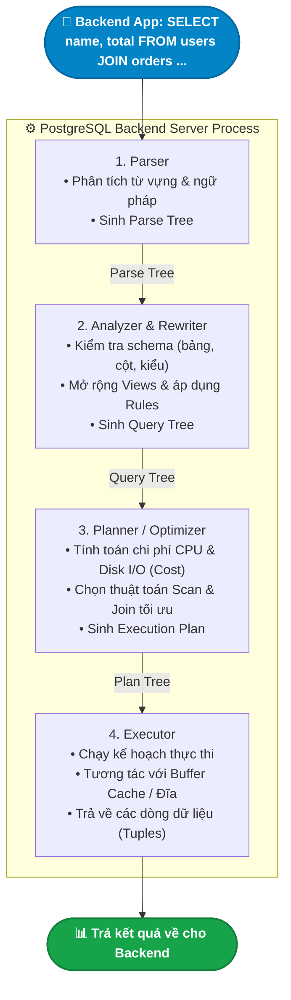

# 🔍 Query Processing Engine in PostgreSQL (Vòng Đời Xử Lý Truy Vấn)

> 💡 **Khái niệm:**  
> **Query Processing (Xử Lý Truy Vấn)** là toàn bộ quá trình mà PostgreSQL tiếp nhận một chuỗi câu lệnh SQL thô từ ứng dụng Backend, giải nghĩa, tìm ra kế hoạch chạy tối ưu nhất và trả về dữ liệu kết quả cho client.  
> Quá trình này diễn ra tuần tự qua **4 giai đoạn cốt lõi**: **Parser $\to$ Rewriter $\to$ Planner/Optimizer $\to$ Executor**.

---

## 1. Sơ Đồ Tổng Quan Vòng Đời Truy Vấn



---

## 2. Chi Tiết 4 Giai Đoạn Xử Lý

### 1️⃣ Parser (Bộ Phân Tích Cú Pháp)
- **Nhiệm vụ:** Kiểm tra xem câu lệnh SQL của bạn có đúng ngữ pháp hay không.
- **Cách hoạt động:**
  - Sử dụng bộ phân tích từ vựng (**Lexer**) và bộ phân tích cú pháp chuẩn (**Bison**).
  - Tách chuỗi ký tự thành các tokens (`SELECT`, `FROM`, `WHERE`, tên cột, toán tử...).
  - Nếu bạn gõ sai cú pháp (như thiếu dấu phẩy, viết sai chữ `WHEREE`), Parser lập tức trả lỗi `syntax error at or near...`.
  - Kết quả đầu ra là một **Parse Tree** (cây cú pháp trừu tượng).

---

### 2️⃣ Analyzer & Rewriter (Phân Tích Ngữ Nghĩa & Viết Lại Truy Vấn)
- **Nhiệm vụ:** Kiểm tra ý nghĩa thực tế và cấu trúc logic của truy vấn.
- **Cách hoạt động:**
  - **Catalog Lookup:** Tra cứu vào System Catalogs (`pg_class`, `pg_attribute`) để xác định:
    - Các bảng và cột được gọi có thực sự tồn tại trong CSDL không?
    - Kiểu dữ liệu giữa các biểu thức so sánh có tương thích không?
    - User hiện tại có quyền `SELECT` / `UPDATE` trên bảng đó không?
  - **View Expansion:** Nếu câu lệnh truy vấn vào một View, Rewriter sẽ "bung" View đó ra thành các câu truy vấn gốc trỏ trực tiếp vào các bảng thật bên dưới.
  - Kết quả đầu ra là một **Query Tree**.

---

### 3️⃣ Planner / Optimizer (Bộ Lập Kế Hoạch & Tối Ưu Hóa) — *Bộ Não Của PostgreSQL*
- **Nhiệm vụ:** Đây là giai đoạn **phức tạp và quan trọng nhất**. Cùng một câu SQL có thể có hàng trăm cách thực thi khác nhau. Optimizer phải tìm ra cách chạy nhanh nhất và tốn ít tài nguyên nhất.
- **Cost-based Optimizer (Bộ Tối Ưu Hóa Dựa Trên Chi Phí):**
  - PostgreSQL duy trì các số liệu thống kê dữ liệu thực tế trong bảng `pg_statistic` (phân bố dữ liệu, số lượng dòng, độ duy nhất...).
  - Với mỗi phương án, Planner tính toán **Cost (điểm chi phí)** dự kiến dựa trên số block đĩa cần đọc và số chu kỳ CPU cần tính toán.
  - Phương án nào có **Cost thấp nhất** sẽ được chọn làm **Execution Plan**.

#### Các quyết định trọng yếu của Planner:
1. **Lựa chọn cách quét dữ liệu (Scan Methods):**
   - `Seq Scan (Sequential Scan)`: Quét toàn bộ bảng từ đầu đến cuối (dùng khi bảng nhỏ hoặc cần đọc phần lớn dữ liệu).
   - `Index Scan`: Dùng B-Tree Index để nhảy thẳng tới dòng cần tìm (rất nhanh khi tìm kiếm số ít dòng).
   - `Index Only Scan`: Lấy toàn bộ dữ liệu cần thiết ngay trên Index mà không cần đọc vào bảng chính.
   - `Bitmap Index Scan`: Kết hợp nhiều index với nhau hoặc lọc trước các trang dữ liệu tiềm năng.
2. **Lựa chọn cách nối bảng (Join Algorithms):**
   - `Nested Loop Join`: Lặp từng dòng của bảng A để tìm dòng khớp ở bảng B (rất tốt khi một bên có index và ít dòng).
   - `Hash Join`: Tạo bảng băm (Hash Table) trong bộ nhớ cho bảng nhỏ rồi quét bảng lớn (tối ưu cho tập dữ liệu lớn).
   - `Merge Join`: Sắp xếp cả hai bảng theo khóa join rồi so khớp tuần tự (rất nhanh khi hai bảng đã được sort sẵn).

---

### 4️⃣ Executor (Bộ Thực Thi Kế Hoạch)
- **Nhiệm vụ:** Thực sự chạy câu lệnh theo Execution Plan đã được phê duyệt.
- **Cơ chế hoạt động (Volcano Iterator Model):**
  - Kế hoạch thực thi là một cây các nút (Nodes).
  - Executor xử lý từ trên xuống theo cơ chế lặp: mỗi nút gọi lệnh `Next()` để kéo từng dòng dữ liệu (tuple) từ nút con bên dưới lên.
  - Executor làm việc với **Buffer Manager**:
    - Nếu trang dữ liệu đã có sẵn trên RAM (Shared Buffers) $\to$ Đọc ngay (**Cache Hit**).
    - Nếu chưa có $\to$ Gọi hệ điều hành đọc từ đĩa lên RAM (**Disk Read**).
  - Dữ liệu sau khi lọc được đóng gói và truyền qua socket về cho Backend.

---

## 3. Thực Hành: Xem Kế Hoạch Thực Thi Với `EXPLAIN`

Backend Developer có thể trực tiếp quan sát giai đoạn Planner và Executor bằng câu lệnh `EXPLAIN`:

```sql
-- 1. Chỉ xem kế hoạch dự kiến của Planner (không thực sự chạy câu lệnh)
EXPLAIN SELECT * FROM users WHERE email = 'test@example.com';

-- 2. Thực sự CHẠY câu lệnh và đo lường thời gian thực tế chi tiết
EXPLAIN (ANALYZE, BUFFERS) 
SELECT u.name, COUNT(o.id) 
FROM users u 
JOIN orders o ON u.id = o.user_id 
WHERE u.status = 'ACTIVE' 
GROUP BY u.name;
```

### Kết quả mẫu và cách đọc:
```text
HashAggregate  (cost=45.20..47.20 rows=200 width=40) (actual time=0.852..0.865 rows=150 loops=1)
  Group Key: u.name
  Buffers: shared hit=12
  ->  Hash Join  (cost=12.50..38.70 rows=520 width=36) (actual time=0.215..0.540 rows=500 loops=1)
        Hash Cond: (o.user_id = u.id)
        ->  Seq Scan on orders o  (cost=0.00..20.00 rows=1000 width=8)
        ->  Hash  (cost=10.00..10.00 rows=200 width=36)
              ->  Index Scan using idx_users_status on users u  (cost=0.15..10.00 rows=200 width=36)
                    Index Cond: (status = 'ACTIVE'::text)
Planning Time: 0.180 ms
Execution Time: 0.912 ms
```
- `cost=12.50..38.70`: Chi phí khởi động..chi phí hoàn tất ước tính.
- `actual time=...`: Thời gian chạy thực tế (tính bằng mili-giây).
- `Buffers: shared hit=12`: Đọc 12 blocks từ RAM (không phải đọc đĩa vật lý $\to$ Rất nhanh!).

---

## 4. Lời Khuyên Tối Ưu Truy Vấn Cho Backend Developer

1. **Tránh `SELECT *`:** Luôn chỉ định rõ các cột cần dùng. Điều này giúp Postgres có cơ hội sử dụng **Index Only Scan** mà không cần tốn công đọc vào heap table.
2. **Hạn chế hàm trên cột so sánh:**  
   - ❌ `WHERE DATE(created_at) = '2026-09-11'` $\to$ Khiến Planner bỏ qua Index và chuyển sang `Seq Scan`.
   - ✅ `WHERE created_at >= '2026-09-11 00:00:00' AND created_at < '2026-09-12 00:00:00'` $\to$ Sử dụng được Index B-Tree.
3. **Chạy `ANALYZE` định kỳ:** Giúp cập nhật bảng thống kê `pg_statistic`, đảm bảo Optimizer luôn có số liệu chính xác nhất để đưa ra kế hoạch thực thi chuẩn xác.
