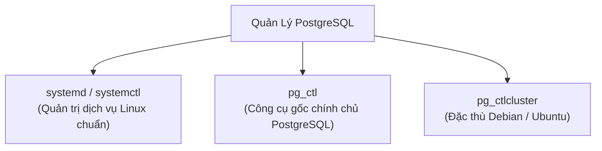

# ⚙️ Quản Trị Tiến Trình PostgreSQL (`systemd`, `pg_ctl`, `pg_ctlcluster`)

Khi deploy PostgreSQL lên server Linux hoặc vận hành trong môi trường production, lập trình viên Backend và DevOps cần nắm vững cách điều khiển, kiểm tra trạng thái và xử lý sự cố database ở cấp độ tiến trình hệ điều hành (Process & Service Management).

---

## 🧭 1. Tổng Quan 3 Công Cụ Quản Trị



| Công cụ | Môi trường áp dụng | Vai trò chính |
| :--- | :--- | :--- |
| **`systemd` (`systemctl`)** | Hầu hết các bản phân phối Linux (Ubuntu, Debian, RHEL, CentOS) | Quản lý PostgreSQL như một Background Service tự khởi động cùng OS. |
| **`pg_ctl`** | Mọi OS (Linux, macOS, Windows) | Tiện ích gốc của PostgreSQL, điều khiển trực tiếp trên thư mục dữ liệu (`PGDATA`). |
| **`pg_ctlcluster`** | Chỉ có trên Debian / Ubuntu | Wrapper quản trị khi máy cài nhiều phiên bản / nhiều cluster PostgreSQL cùng lúc. |

---

## 🐧 2. Quản Trị Bằng `systemd` (`systemctl`) — Chuẩn Cho Server

Hầu hết server production chạy Linux đều quản lý PostgreSQL thông qua `systemd`:

```bash
# 1. Kiểm tra trạng thái hoạt động (đang chạy hay đã chết)
sudo systemctl status postgresql

# 2. Khởi động service
sudo systemctl start postgresql

# 3. Dừng service
sudo systemctl stop postgresql

# 4. Khởi động lại (Hard Restart - ngắt kết nối hiện tại)
sudo systemctl restart postgresql

# 5. Tải lại cấu hình không cần ngắt kết nối (Graceful Reload)
# Dùng sau khi sửa postgresql.conf hoặc pg_hba.conf
sudo systemctl reload postgresql

# 6. Cho phép tự động chạy khi server boot
sudo systemctl enable postgresql
```

---

## 🛠️ 3. Quản Trị Bằng `pg_ctl` — Công Cụ Gốc Của PostgreSQL

`pg_ctl` tương tác trực tiếp với dữ liệu mà không cần thông qua trình quản lý dịch vụ của hệ điều hành. Cần chỉ định thư mục dữ liệu (`-D` / `PGDATA`).

```bash
# Kiểm tra trạng thái
pg_ctl -D /path/to/data status

# Khởi động database
pg_ctl -D /path/to/data start

# Tắt database an toàn (chờ các transaction hoàn tất)
pg_ctl -D /path/to/data -m fast stop

# Reload cấu hình không cần restart
pg_ctl -D /path/to/data reload
```

> 💡 **3 Chế độ tắt (-m mode) trong `pg_ctl stop`:**
> - `smart`: Chờ tất cả client chủ động ngắt kết nối mới tắt (có thể chờ rất lâu).
> - `fast` *(Mặc định & Khuyên dùng)*: Ngắt ngay các kết nối client, rollback các giao dịch dở dang và ghi WAL checkpoint sạch sẽ.
> - `immediate`: Tắt khẩn cấp ngay lập tức (giống rút điện). Lần khởi động tiếp theo server sẽ phải thực hiện Crash Recovery từ WAL.

---

## 📦 4. Quản Trị Bằng `pg_ctlcluster` (Đặc thù Debian / Ubuntu)

Khi bạn cài PostgreSQL qua `apt` trên Ubuntu, hệ điều hành bọc các tiến trình vào công cụ `pg_ctlcluster` theo cấu trúc `<version> <cluster_name>` (mặc định cluster tên là `main`):

```bash
# Cú pháp: pg_ctlcluster <version> <cluster> <action>

# Kiểm tra trạng thái cluster 16 main
pg_ctlcluster 16 main status

# Khởi động / Khởi động lại
sudo pg_ctlcluster 16 main start
sudo pg_ctlcluster 16 main restart

# Reload file cấu hình
sudo pg_ctlcluster 16 main reload

# Liệt kê tất cả các cluster đang có trên server
pg_lsclusters
```

---

## 🚨 5. Checklist Xử Lý Khi Service Không Khởi Động Được

1. **Xem log chi tiết của hệ thống:**
   ```bash
   sudo journalctl -u postgresql -n 50 --no-pager
   ```
2. **Kiểm tra file PID bị kẹt:** Nếu server bị cúp điện đột ngột, file khóa `postmaster.pid` còn sót lại sẽ ngăn server khởi động.
3. **Kiểm tra dung lượng ổ đĩa:** Ổ cứng bị đầy 100% là nguyên nhân hàng đầu khiến database tự động ngắt (`df -h`).
