# 🐘 PostgreSQL Overview & Core Fundamentals

> 💡 **What is PostgreSQL?**  
> **PostgreSQL** is an advanced, open-source RDBMS known for **robustness**, **extensibility**, and **standards compliance**. It supports complex queries, custom data types, full-text search, and **ACID properties**. Highly extensible with strong concurrency support, suitable for web apps to data warehousing.

---

## 1. Bản Chất & Vị Thế Của PostgreSQL

- **PostgreSQL** (thường gọi tắt là **Postgres**) là hệ quản trị cơ sở dữ liệu quan hệ mã nguồn mở mạnh mẽ nhất hiện nay, có lịch sử phát triển hơn 35 năm từ dự án POSTGRES tại Đại học California, Berkeley.
- Khác với nhiều RDBMS truyền thống, PostgreSQL là một **Object-Relational Database (ORDBMS)**, kết hợp giữa tính toàn vẹn của mô hình bảng quan hệ (Tables, Foreign Keys, SQL) với tính linh hoạt của mô hình hướng đối tượng / NoSQL (Custom Types, Inheritance, JSONB document).
- Được bình chọn là cơ sở dữ liệu phổ biến và được yêu thích hàng đầu bởi các Backend Engineers trên toàn thế giới (theo khảo sát thường niên của Stack Overflow).

---

## 2. Các Đặc Tính Cốt Lõi (Core Features)

```mermaid
flowchart TD
    Core(["🐘 <b>PostgreSQL Core (ORDBMS)</b>"]):::coreStyle

    subgraph P1["🛡️ 1. ACID & Độ Tin Cậy"]
        direction TB
        A1["Write-Ahead Logging (WAL)"]
        A2["Point-in-Time Recovery (PITR)"]
        A3["Strict Constraints & Foreign Keys"]
    end

    subgraph P2["📦 2. Kiểu Dữ Liệu Đa Dạng"]
        direction TB
        B1["JSON / JSONB (NoSQL lai)"]
        B2["Native UUID & Mảng (Arrays)"]
        B3["Range Types & Tọa độ PostGIS"]
    end

    subgraph P3["⚡ 3. Đồng Thời Cao (MVCC)"]
        direction TB
        C1["Đọc không bao giờ chặn Ghi"]
        C2["Snapshot Isolation đa tầng"]
        C3["Khóa mịn từng dòng (Row-level Locking)"]
    end

    subgraph P4["🔌 4. Khả Năng Mở Rộng"]
        direction TB
        D1["Extensions (pgvector, pgcrypto)"]
        D2["Ngôn ngữ hàm (PL/pgSQL, Python)"]
        D3["Đa dạng Index (B-Tree, GIN, GiST, BRIN)"]
    end

    Core --> P1
    Core --> P2
    Core --> P3
    Core --> P4

    classDef coreStyle fill:#336791,stroke:#1d4ed8,stroke-width:2px,color:#ffffff,font-weight:bold;
```



### 2.1. Tuân thủ chuẩn ACID tuyệt đối
- Bảo đảm tính **Toàn vẹn dữ liệu** ở mức cao nhất. Phù hợp hoàn hảo cho các hệ sinh thái tài chính, ngân hàng, thanh toán và thương mại điện tử:
  - **Atomicity:** Giao dịch thành công trọn vẹn hoặc rollback toàn bộ.
  - **Consistency:** Dữ liệu luôn thỏa mãn các ràng buộc (Check, Unique, Foreign Key).
  - **Isolation:** Đa dạng cấp độ cô lập giao dịch (Read Committed, Repeatable Read, Serializable).
  - **Durability:** Cơ chế **Write-Ahead Logging (WAL)** ghi nhận thay đổi xuống đĩa trước khi commit, đảm bảo không bao giờ mất dữ liệu ngay cả khi server mất điện đột ngột.

### 2.2. Kiểu dữ liệu hiện đại & Hỗ trợ NoSQL (JSONB)
- **JSONB (Binary JSON):** Lưu trữ JSON dưới dạng nhị phân đã phân tích cú pháp, cho phép đánh chỉ mục (Index) trực tiếp vào từng trường bên trong JSON. Truy vấn nhanh tương đương MongoDB nhưng vẫn giữ trọn vẹn sức mạnh liên kết bảng (JOIN) của SQL.
- **UUID & Arrays:** Lưu danh sách mảng số, chuỗi, hoặc định danh UUID nguyên bản mà không cần tạo bảng phụ.
- **Range Types:** Lưu trữ khoảng ngày tháng, khoảng số thực (VD: `tsrange`, `daterange`) phục vụ bài toán đặt phòng (booking), lịch hẹn.

### 2.3. Cơ chế kiểm soát đồng thời MVCC (Multi-Version Concurrency Control)
- Triết lý cốt lõi: **"Readers do not block writers, and writers do not block readers"** (Người đọc không bao giờ phải đợi người ghi, và người ghi không bao giờ chặn người đọc).
- Khi một dòng dữ liệu được cập nhật, Postgres không ghi đè trực tiếp lên ô nhớ cũ mà tạo ra một **phiên bản mới (tuple)** của dòng đó kèm timestamp/Transaction ID. Các transaction khác nhau sẽ nhìn thấy snapshot phù hợp với thời điểm của mình.
- Tiến trình chạy ngầm **VACUUM** định kỳ dọn dẹp các phiên bản dữ liệu cũ (dead tuples) để thu hồi dung lượng đĩa.

### 2.4. Hệ sinh thái Index phong phú
Không chỉ có B-Tree như các RDBMS khác, Postgres hỗ trợ nhiều cấu trúc chỉ mục chuyên biệt:
- **B-Tree:** Mặc định, tối ưu cho so sánh bằng (`=`) và tìm kiếm theo dải (`<`, `<=`, `>`, `BETWEEN`).
- **GIN (Generalized Inverted Index):** Chuyên dùng cho tìm kiếm toàn văn (**Full-Text Search**), mảng (**Array**), và các trường tài liệu **JSONB**.
- **GiST / SP-GiST:** Tối ưu cho dữ liệu hình học, bản đồ tọa độ GPS (PostGIS).
- **BRIN (Block Range Index):** Chỉ mục siêu nhẹ cho bảng dữ liệu khổng lồ hàng tỷ dòng được sắp xếp theo thời gian (Time-series data, Logs).

---

## 3. So Sánh PostgreSQL vs MySQL (Góc Nhìn Backend Developer)

| Tiêu Chí | PostgreSQL | MySQL |
| :--- | :--- | :--- |
| **Loại hình** | Object-Relational (ORDBMS) | Relational (RDBMS) |
| **Thế mạnh chính** | Xử lý truy vấn phức tạp, phân tích dữ liệu, toàn vẹn dữ liệu nghiêm ngặt. | Đọc dữ liệu đơn giản tốc độ cao, cấu hình ban đầu nhanh gọn. |
| **Hỗ trợ JSON** | Vượt trội với **JSONB** (được đánh chỉ mục GIN, truy vấn cực nhanh). | Có kiểu JSON từ MySQL 5.7+ nhưng tính năng và tốc độ đánh index hạn chế hơn. |
| **Khả năng mở rộng** | Rất cao nhờ hệ thống **Extensions** (`pgvector`, `PostGIS`, `timescaledb`). | Chủ yếu giới hạn trong các Storage Engines có sẵn (InnoDB). |
| **Xử lý đồng thời (Concurrency)** | **MVCC nâng cao**, hỗ trợ nhiều tiến trình đọc/ghi song song tải nặng. | Dùng cơ chế khóa (Row-level Locking trong InnoDB) kết hợp Undo Log. |
| **Phù hợp nhất cho** | Web apps hiện đại, FinTech, SaaS phức tạp, Dịch vụ AI (vector search), Data Warehousing. | Blog cá nhân, CMS (WordPress), website thương mại đơn giản. |

---

## 4. Cú Pháp Cơ Bản & Lệnh `psql` Thường Dùng

### 4.1. Các lệnh tắt trong CLI `psql`:
- `\l` : Danh sách tất cả databases.
- `\c <dbname>` : Kết nối chuyển sang database `<dbname>`.
- `\dt` : Liệt kê tất cả các bảng trong database hiện tại.
- `\d+ <tablename>` : Xem cấu trúc chi tiết của bảng (các cột, kiểu dữ liệu, index, constraints).
- `\dn` : Liệt kê danh sách Schemas.
- `\q` : Thoát khỏi `psql`.

### 4.2. Khởi tạo Bảng hiện đại trong PostgreSQL:
```sql
-- Kích hoạt Extension UUID nếu muốn dùng tự sinh uuid ngẫu nhiên
CREATE EXTENSION IF NOT EXISTS "uuid-ossp";

-- Tạo bảng Users với các kiểu dữ liệu chuẩn Backend
CREATE TABLE users (
    id UUID PRIMARY KEY DEFAULT uuid_generate_v4(),
    username VARCHAR(50) NOT NULL UNIQUE,
    email VARCHAR(255) NOT NULL UNIQUE,
    profile JSONB DEFAULT '{}'::jsonb,           -- Lưu thuộc tính động dạng JSONB
    roles TEXT[] DEFAULT '{"USER"}',              -- Lưu mảng chuỗi quyền hạn
    is_active BOOLEAN DEFAULT TRUE,
    created_at TIMESTAMPTZ DEFAULT CURRENT_TIMESTAMP, -- Lưu thời gian kèm Múi giờ
    updated_at TIMESTAMPTZ DEFAULT CURRENT_TIMESTAMP
);

-- Đánh chỉ mục GIN cho cột JSONB để tăng tốc truy vấn thuộc tính bên trong
CREATE INDEX idx_users_profile ON users USING GIN (profile);
```

### 4.3. Truy vấn dữ liệu JSONB linh hoạt:
```sql
-- Tìm tất cả user có sở thích là 'coding' bên trong JSONB profile
SELECT id, username, profile->>'full_name' AS full_name
FROM users
WHERE profile @> '{"skills": ["Java", "Spring Boot"]}';
```

---

## 5. Tóm Tắt Nhanh (Key Takeaway)

- **PostgreSQL:** RDBMS mã nguồn mở mạnh mẽ, chuẩn hóa cao và đáng tin cậy nhất cho các hệ thống phần mềm chuyên nghiệp.
- **Điểm sáng:** Hỗ trợ NoSQL lai với **JSONB**, cơ chế đồng thời **MVCC**, hệ sinh thái **Extensions** phong phú và độ tuân thủ **ACID** chuẩn mực.
- **Lựa chọn hàng đầu:** Cho các dự án Backend từ REST APIs, Microservices, FinTech đến ứng dụng AI tích hợp tìm kiếm vector (`pgvector`).
