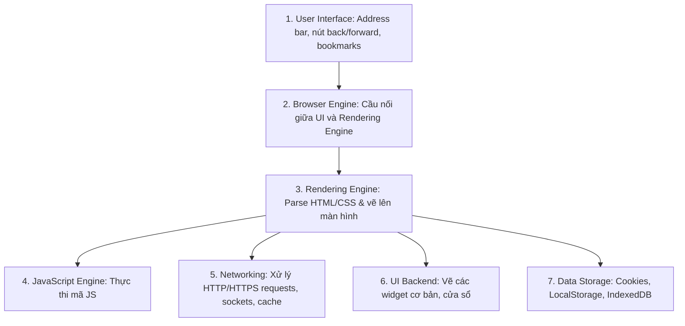

# 🧭 Web Browsers (Trình Duyệt Web)

> 💡 **What is a Web Browser?**  
> **Web browsers** interpret HTML, CSS, and JavaScript to render web pages. Modern browsers use **rendering engines** (Blink, Gecko, WebKit) and **JavaScript engines**, offering features like tabs, bookmarks, extensions, and security through **sandboxing** and **HTTPS enforcement**.

---

## 1. Bản Chất Của Web Browser

- Trình duyệt web (Google Chrome, Safari, Firefox, Microsoft Edge, Brave) là phần mềm client cho phép người dùng định vị, truy xuất và hiển thị nội dung trên World Wide Web.
- Dữ liệu trả về từ server là các file văn bản thuần túy (HTML, CSS, JS) và tài nguyên media (ảnh, font). Nhiệm vụ cốt lõi của trình duyệt là biên dịch các dòng code này thành giao diện trực quan có thể tương tác được.

---

## 2. Kiến Trúc Cốt Lõi Của Trình Duyệt Hiện Đại

Một trình duyệt hiện đại bao gồm các thành phần phối hợp chặt chẽ:



### Các Engine phổ biến nhất hiện nay:
| Trình Duyệt | Rendering Engine (HTML/CSS) | JavaScript Engine |
| :--- | :--- | :--- |
| **Google Chrome / MS Edge / Opera / Brave** | **Blink** (Phát triển từ WebKit của Google) | **V8** (Cực nhanh, cũng là nền tảng của Node.js) |
| **Mozilla Firefox** | **Gecko** | **SpiderMonkey** |
| **Apple Safari** | **WebKit** | **JavaScriptCore (Nitro)** |

---

## 3. Quy Trình Render Trang Web (Critical Rendering Path)

Khi nhận được tài liệu HTML từ Web Server, trình duyệt thực hiện quy trình 5 bước để vẽ ra màn hình:

```text
 1. Parse HTML  ──> Xây dựng DOM Tree (Document Object Model - cấu trúc phần tử)
 2. Parse CSS   ──> Xây dựng CSSOM Tree (CSS Object Model - quy tắc định dạng)
 3. Kết hợp     ──> Tạo Render Tree (Chỉ chứa các phần tử thực sự hiển thị trên màn hình)
 4. Layout      ──> Tính toán kích thước (width/height) và vị trí tọa độ (x, y) của từng phần tử
 5. Paint       ──> Vẽ các pixel màu, hình ảnh, văn bản lên màn hình (Rasterization & Compositing)
```

---

## 4. Các Tính Năng & Cơ Chế Bảo Mật Trên Trình Duyệt

1. **Sandboxing (Hộp cát):** Mỗi tab hoặc extension chạy trong một tiến trình (process) độc lập bị cô lập. Nếu một trang web chứa mã độc bị sập, nó không thể can thiệp vào các tab khác hoặc xâm nhập hệ điều hành máy tính.
2. **Same-Origin Policy (SOP):** Ngăn chặn script từ trang web A truy cập dữ liệu nhạy cảm của trang web B trừ khi server đích cho phép qua cơ chế **CORS (Cross-Origin Resource Sharing)**.
3. **Bắt buộc HTTPS & HSTS (HTTP Strict Transport Security):** Cảnh báo hoặc chặn người dùng truy cập các trang web HTTP không an toàn nhằm chống tấn công nghe lén dữ liệu.
4. **Lưu trữ phía Client (Client-Side Storage):**
   - **Cookies:** Lưu session ID, token đăng nhập (thường kèm cờ `HttpOnly`, `Secure`).
   - **LocalStorage / SessionStorage:** Lưu dữ liệu key-value đơn giản (5-10MB).
   - **IndexedDB:** Cơ sở dữ liệu NoSQL lưu trữ lượng lớn dữ liệu offline trong trình duyệt.

---

## 5. Tóm Tắt Nhanh (Key Takeaway)

- **Browser:** Bộ biên dịch code web thành giao diện đồ họa.
- **Trọng tâm:** Bộ đôi **Rendering Engine** (vẽ giao diện) và **JavaScript Engine** (xử lý logic).
- **Bảo mật:** Sandboxing đa tiến trình, thực thi SOP/CORS và cưỡng chế kết nối bảo mật HTTPS.
