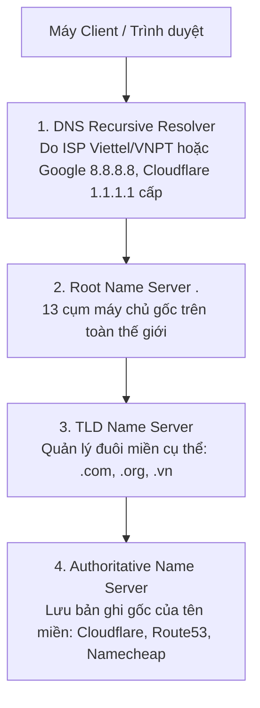

# 📡 DNS (Domain Name System)

> 💡 **What is DNS?**  
> **DNS (Domain Name System)** translates human-readable domain names into IP addresses. It uses a hierarchical structure with root servers, TLD servers (`.com`, `.org`), authoritative servers, and local DNS servers. Essential for internet functionality, enabling memorable names instead of IP addresses.

---

## 1. Bản Chất Của DNS

- DNS hoạt động như **"Cuốn danh bạ điện thoại của Internet"**.
- Khi bạn gõ `facebook.com`, máy tính của bạn không biết `facebook.com` ở đâu trên mạng. Nó phải hỏi hệ thống DNS để lấy về địa chỉ IP thực tế (ví dụ: `157.240.241.35`) nhằm tạo kết nối TCP/IP.

---

## 2. Mô Hình Phân Cấp Của Hệ Thống DNS (4 Tầng Máy Chủ)

Hệ thống DNS toàn cầu được thiết kế theo cấu trúc phân cấp hình cây (Tree Hierarchy) để đảm bảo tính phân tán và chịu tải cao:

### Luồng truy vấn 4 bước khi chưa có Cache:
1. **DNS Resolver:** Nhận yêu cầu từ người dùng, đứng ra đi hỏi các server cấp cao hơn.
2. **Root Server (`.`):** Không biết IP của website, nhưng chỉ dẫn Resolver tới đúng **TLD Server** quản lý đuôi tên miền (ví dụ: nhóm `.com`).
3. **TLD Server (`.com`):** Chỉ dẫn Resolver tới đúng **Authoritative Name Server** quản lý tên miền đó.
4. **Authoritative Server:** Nơi lưu trữ cấu hình chính thức, trả về địa chỉ **IP chính xác** (A Record) cho Resolver để gửi về cho Client.

---

## 3. Các Loại Bản Ghi DNS Cốt Lõi (DNS Records)

Khi cấu hình tên miền cho hệ thống Backend, bạn sẽ thường xuyên làm việc với các bản ghi sau:

| Loại Record | Tên Đầy Đủ | Mục Đích Sử Dụng | Ví Dụ Giá Trị |
| :--- | :--- | :--- | :--- |
| **A** | Address Record | Trỏ tên miền trực tiếp tới địa chỉ **IPv4** của server. | `api.mysite.com` $\rightarrow$ `103.20.14.5` |
| **AAAA** | IPv6 Address Record | Trỏ tên miền tới địa chỉ **IPv6** (128-bit) của server. | `mysite.com` $\rightarrow$ `2001:0db8:...` |
| **CNAME** | Canonical Name | Trỏ một tên miền phụ sang tên miền khác (Bí danh / Alias). | `www.mysite.com` $\rightarrow$ `mysite.com` |
| **MX** | Mail Exchange | Định tuyến email gửi đến tên miền về đúng Mail Server. | `mysite.com` $\rightarrow$ `mail.google.com` (Priority 10) |
| **TXT** | Text Record | Lưu chuỗi text tùy ý (dùng xác thực chủ sở hữu, SPF/DKIM chống spam email). | `"v=spf1 include:_spf.google.com ~all"` |
| **NS** | Name Server | Chỉ định Authoritative DNS Server nào đang quản trị tên miền này. | `ns1.cloudflare.com`, `ns2.cloudflare.com` |

---

## 4. Cơ Chế DNS Cache & TTL (Time To Live)

- Để không phải tốn thời gian thực hiện lại toàn bộ quy trình hỏi đường cho mỗi lượt click, kết quả DNS được lưu đệm (**Cache**) ở nhiều tầng: **Trình duyệt $\rightarrow$ Hệ điều hành $\rightarrow$ Router mạng $\rightarrow$ DNS Resolver của ISP**.
- **TTL (Time To Live):** Thời gian tính bằng giây quy định bản ghi DNS được phép lưu trong bộ nhớ đệm trước khi phải truy vấn lại bản ghi mới từ Authoritative Server.
  - *TTL cao (VD: 86400s - 1 ngày):* Tối ưu tốc độ, giảm tải DNS Server.
  - *TTL thấp (VD: 300s - 5 phút):* Thường dùng khi chuẩn bị chuyển đổi server (Migration) để cập nhật IP mới nhanh chóng.

---

## 5. Tóm Tắt Nhanh (Key Takeaway)

- **DNS:** Bộ biên dịch `Tên miền -> IP`.
- **Thứ bậc:** Client $\rightarrow$ Resolver $\rightarrow$ Root Server $\rightarrow$ TLD Server $\rightarrow$ Authoritative Server.
- **Cache & TTL:** Quyết định tốc độ phản hồi và thời gian cập nhật bản ghi mạng.
