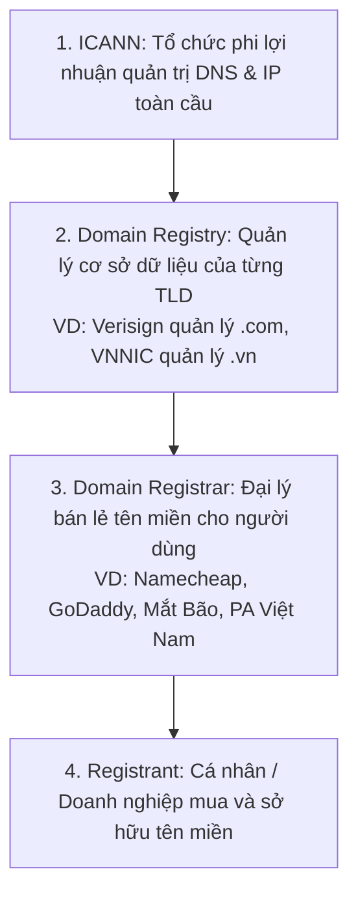

# 🏷️ Domain Name (Tên Miền)

> 💡 **What is a Domain Name?**  
> **Domain names** are human-readable internet addresses that translate to IP addresses for computer identification. Consists of a second-level domain (e.g. `"example"`) and a top-level domain (e.g. `".com"`). Managed by registrars, providing user-friendly website navigation instead of numeric IP addresses.

---

## 1. Bản Chất Của Domain Name

- Máy tính và thiết bị mạng giao tiếp với nhau bằng **địa chỉ IP** dạng số (ví dụ: `142.250.190.46`).
- Con người không thể nhớ hàng trăm dãy số IP phức tạp, do đó **Domain Name** ra đời như một lớp đại diện thân thiện, dễ đọc, dễ nhớ cho con người (ví dụ: `google.com`).
- Hệ thống **DNS (Domain Name System)** đóng vai trò cuốn danh bạ giúp chuyển đổi tên miền thành địa chỉ IP tương ứng.

---

## 2. Cấu Trúc Của Một Tên Miền (Hierarchy)

Tên miền được cấu tạo theo thứ bậc phân cấp từ phải sang trái, ngăn cách bởi dấu chấm (`.`):

```text
       sub.api.example.com.
        │   │     │     │ └─ [1] Root Domain (.)
        │   │     │     └─── [2] Top-Level Domain (TLD)
        │   │     └───────── [3] Second-Level Domain (SLD)
        │   └─────────────── [4] Subdomain
        └─────────────────── [5] Sub-subdomain
```

| Cấp Bậc | Tên Gọi | Ví Dụ | Vai Trò |
| :--- | :--- | :--- | :--- |
| **Root** | Root Domain | `.` (dấu chấm cuối) | Gốc cao nhất của cây DNS toàn cầu. |
| **TLD** | Top-Level Domain | `.com`, `.org`, `.vn`, `.io` | Phần mở rộng cao nhất, phân loại theo mục đích hoặc quốc gia. |
| **SLD** | Second-Level Domain | `google`, `facebook`, `shopee` | Tên thương hiệu/tổ chức cụ thể đăng ký sở hữu. |
| **Subdomain** | Tên miền phụ | `api`, `blog`, `admin`, `dev` | Chia nhánh hệ thống/dịch vụ nội bộ của tổ chức. |

### Phân loại TLD phổ biến:
- **gTLD (Generic TLD):** Tên miền dùng chung toàn cầu (`.com`, `.net`, `.org`, `.edu`).
- **ccTLD (Country Code TLD):** Tên miền theo mã quốc gia (`.vn` - Việt Nam, `.jp` - Nhật Bản, `.us` - Mỹ).
- **New gTLD:** Các đuôi miền hiện đại mới (`.tech`, `.dev`, `.ai`, `.cloud`, `.store`).

---

## 3. Các Đơn Vị Quản Lý Tên Miền

Quá trình cấp phát và vận hành tên miền diễn ra qua 3 cấp quản lý:



---

## 4. Tóm Tắt Nhanh (Key Takeaway)

- **Domain Name:** Địa chỉ nhà dễ nhớ của website trên Internet.
- **Cấu trúc:** Gồm ít nhất SLD (tên) + TLD (đuôi mở rộng).
- **Phân giải:** Luôn cần hệ thống DNS để dịch thành IP trước khi máy tính có thể kết nối.
