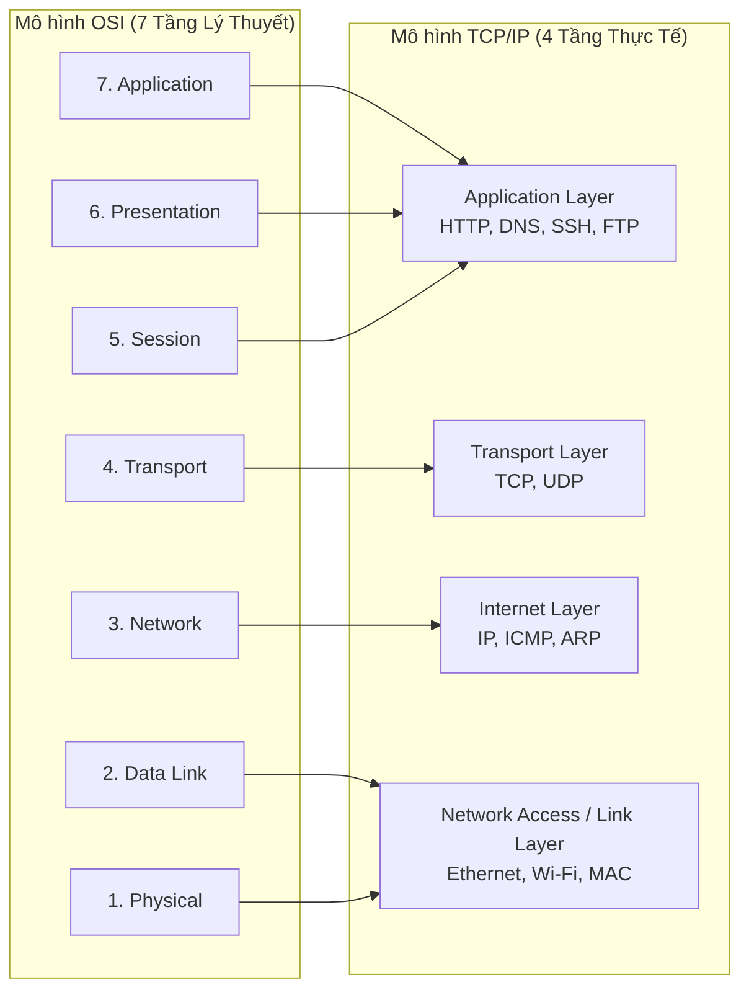
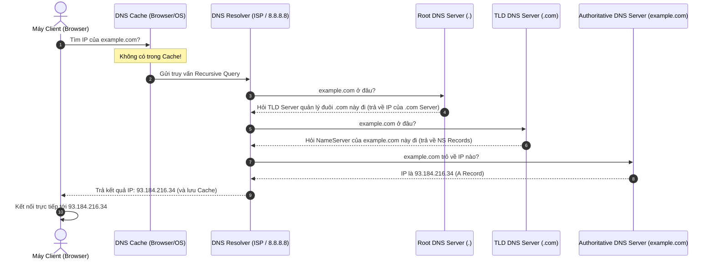
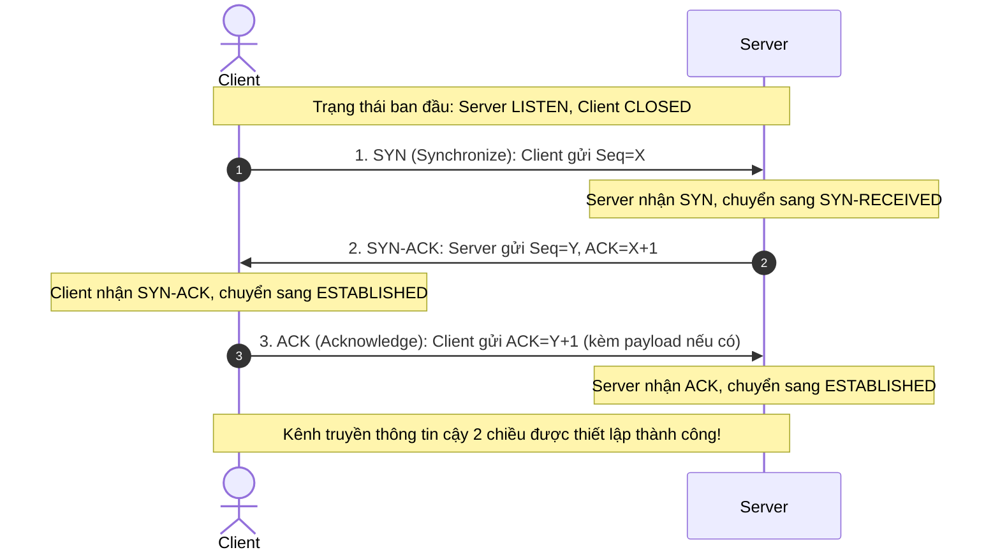
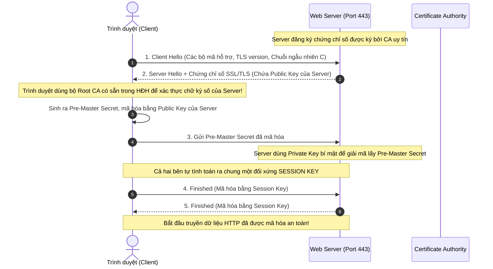
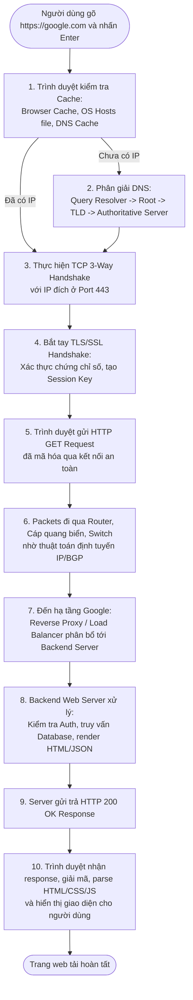

# 🌐 How Does The Internet Work? (Internet Hoạt Động Như Thế Nào?)

Tài liệu chi tiết giải thích toàn bộ nguyên lý hoạt động của Internet từ mức vật lý, tầng mạng, giao thức truyền dẫn (TCP/IP), phân giải tên miền (DNS), cho đến tầng ứng dụng (HTTP/HTTPS, SSL/TLS) và hành trình trọn vẹn của một Web Request.

---

## 📑 Mục Lục (Table of Contents)

1. [Bản Chất Của Internet: Mạng Của Các Mạng](#1-bản-chất-của-internet-mạng-của-các-mạng)
2. [Phân Biệt Internet và World Wide Web (WWW)](#2-phân-biệt-internet-và-world-wide-web-www)
3. [Mô Hình Kiến Trúc Mạng: OSI vs TCP/IP](#3-mô-hình-kiến-trúc-mạng-osi-vs-tcpip)
4. [Dữ Liệu Di Chuyển Như Thế Nào? (Packets & Routers)](#4-dữ-liệu-di-chuyển-như-thế-nào-packets--routers)
5. [Địa Chỉ IP & Tên Miền (IP Addresses & Domain Names)](#5-địa-chỉ-ip--tên-miền-ip-addresses--domain-names)
6. [Hệ Thống Phân Giải Tên Miền (DNS - Domain Name System)](#6-hệ-thống-phân-giải-tên-miền-dns---domain-name-system)
7. [Tầng Giao Vận (Transport Layer): TCP/IP, UDP & Sockets](#7-tầng-giao-vận-transport-layer-tcpip-udp--sockets)
8. [Tầng Ứng Dụng: HTTP & HTTPS](#8-tầng-ứng-dụng-http--https)
9. [Bảo Mật Truyền Thông Với SSL/TLS](#9-bảo-mật-truyền-thông-với-ssltls)
10. [End-to-End Flow: Chuyện Gì Xảy Ra Khi Gõ `https://google.com`?](#10-end-to-end-flow-chuyện-gì-xảy-ra-khi-gõ-httpsgooglecom)
11. [Xu Hướng Công Nghệ Mạng Hiện Đại (CDN, HTTP/3, Edge)](#11-xu-hướng-công-nghệ-mạng-hiện-đại-cdn-http3-edge)
12. [Cheat Sheet & Câu Hỏi Phỏng Vấn Backend Thường Gặp](#12-cheat-sheet--câu-hỏi-phỏng-vấn-backend-thường-gặp)

---

## 1. Bản Chất Của Internet: Mạng Của Các Mạng

### 1.1. Network là gì?
- **Network (Mạng máy tính):** Là tập hợp từ hai hoặc nhiều thiết bị (máy tính, điện thoại, máy in, server) kết nối với nhau để chia sẻ tài nguyên và dữ liệu.
- Trong gia đình của bạn có một mạng nội bộ (**LAN - Local Area Network**): điện thoại, laptop kết nối vào chung một cục Router Wi-Fi.
- Nhà hàng xóm cũng có một mạng LAN riêng. Công ty, trường học cũng có các mạng LAN riêng.

### 1.2. Internet ra đời như thế nào?
> **Định nghĩa cốt lõi:** *"The Internet is a network of networks."* (Internet là mạng lưới liên kết của các mạng lưới).

- Khi các mạng LAN kết nối lại với nhau trên quy mô thành phố, quốc gia và toàn cầu thông qua các nhà cung cấp dịch vụ mạng (**ISP - Internet Service Provider**) và các trạm trung chuyển Internet (**IXP - Internet Exchange Points**), chúng ta có **Internet**.
- **Lịch sử hình thành:** Tiền thân của Internet là dự án **ARPANET** (Advanced Research Projects Agency Network) do Bộ Quốc phòng Mỹ khởi xướng vào cuối những năm 1960, với mục tiêu tạo ra một mạng lưới truyền thông phi tập trung có khả năng sống sót ngay cả khi một số nút mạng bị phá hủy trong chiến tranh.

```mermaid
graph TD
    subgraph "Mạng Gia Đình A (LAN 1)"
        ClientA1[Laptop A] --- RouterA[Home Router A]
        ClientA2[Phone A] --- RouterA
    end

    subgraph "Mạng Doanh Nghiệp B (LAN 2)"
        ServerB1[Web Server] --- RouterB[Enterprise Router B]
        ServerB2[Database] --- RouterB
    end

    RouterA --> ISP1[Nhà Mạng Viettel/VNPT (Local ISP)]
    RouterB --> ISP2[Nhà Mạng FPT/CMC (Local ISP)]

    ISP1 --> Tier1[Tier-1 Global Backbone / Cáp Quang Biển]
    ISP2 --> Tier1
```

---

## 2. Phân Biệt Internet và World Wide Web (WWW)

Rất nhiều người nhầm lẫn hai khái niệm này, nhưng đối với kỹ sư phần mềm, đây là hai tầng hoàn toàn khác biệt:

| Tiêu Chí | Internet (Cơ sở hạ tầng) | World Wide Web (Dịch vụ trên Internet) |
| :--- | :--- | :--- |
| **Bản chất** | Mạng lưới vật lý & giao thức kết nối hàng tỷ máy tính trên toàn cầu. | Hệ thống các trang tài liệu siêu văn bản (Web pages) truy cập qua Internet. |
| **Giao thức** | TCP, IP, UDP, BGP, ARP, ICMP,... | HTTP, HTTPS, WebSocket,... |
| **Thành phần** | Cáp quang, router, switch, vệ tinh, sóng vô tuyến, máy chủ. | Trình duyệt (Browser), Web Server, HTML, CSS, JavaScript, URL. |
| **Phạm vi** | WWW chỉ là một dịch vụ chạy trên Internet. Ngoài WWW, Internet còn phục vụ: Email (SMTP/IMAP), Chia sẻ file (FTP), Gọi thoại (VoIP), SSH, Game online,... | Một ứng dụng chuyên biệt của Internet để hiển thị và chia sẻ thông tin. |

---

## 3. Mô Hình Kiến Trúc Mạng: OSI vs TCP/IP

Để các thiết bị của hàng ngàn hãng sản xuất khác nhau (Apple, Dell, Cisco, Linux, Windows) có thể nói chuyện được với nhau, các kỹ sư cần các bộ quy tắc chuẩn hóa (**Protocols**).

### 3.1. So sánh 7 tầng OSI và 4 tầng TCP/IP



### 3.2. Quá trình Đóng gói dữ liệu (Encapsulation & Decapsulation)

Khi dữ liệu truyền đi từ máy gửi đến máy nhận:
- **Encapsulation (Bên gửi):** Dữ liệu tầng trên đi xuống tầng dưới sẽ được bọc thêm Header của tầng đó.
  1. **Application:** Sinh ra Payload dữ liệu (VD: HTTP Request string).
  2. **Transport:** Bọc thêm TCP/UDP Header chứa **Source Port** và **Destination Port** -> Tạo thành **Segment / Datagram**.
  3. **Network (Internet):** Bọc thêm IP Header chứa **Source IP** và **Destination IP** -> Tạo thành **Packet**.
  4. **Data Link:** Bọc thêm Ethernet Header/Trailer chứa **Source MAC** và **Destination MAC** -> Tạo thành **Frame**.
  5. **Physical:** Chuyển đổi Frame thành chuỗi bit nhị phân `010101...` truyền qua sóng Wi-Fi hoặc xung điện cáp mạng / ánh sáng cáp quang.
- **Decapsulation (Bên nhận):** Đi ngược từ dưới lên trên, mỗi tầng bóc một lớp Header tương ứng để lấy payload chuyển cho tầng kế tiếp.

---

## 4. Dữ Liệu Di Chuyển Như Thế Nào? (Packets & Routers)

### 4.1. Khái niệm Packet (Gói tin)
Khi bạn tải một file ảnh dung lượng 5MB, Internet **không** gửi nguyên cục 5MB thành một khối liền lạc:
- Nếu đường truyền bị nhiễu và đứt giữa chừng ở 4.9MB, bạn sẽ phải tải lại toàn bộ từ đầu.
- Một file quá lớn truyền liên tục sẽ làm nghẽn đường truyền của những người khác trên cùng đường cáp.
- **Giải pháp:** Dữ liệu được chia nhỏ thành hàng ngàn mảnh nhỏ gọi là **Packets** (thường từ vài trăm byte đến 1500 bytes - MTU tiêu chuẩn). Mỗi packet có header chứa số thứ tự, địa chỉ gửi, địa chỉ nhận.

### 4.2. Vai trò của Router (Bộ định tuyến)
- **Router** giống như các bưu cục trung chuyển trong hệ thống bưu điện.
- Khi nhận được một packet, Router đọc địa chỉ **Destination IP** trong IP Header.
- Dựa vào **Routing Table** (bảng định tuyến) và các thuật toán định tuyến (như BGP, OSPF), Router quyết định đẩy packet sang **Hop** (nút mạng) tiếp theo nào gần đích nhất.
- **Đặc tính Packet Switching:** Các packet của cùng một file có thể đi theo nhiều tuyến đường cáp khác nhau để tránh đoạn đường đang bị tắc nghẽn. Khi đến máy nhận, giao thức TCP sẽ xếp các packet lại theo đúng số thứ tự ban đầu.

---

## 5. Địa Chỉ IP & Tên Miền (IP Addresses & Domain Names)

### 5.1. Địa chỉ IP (Internet Protocol Address)
Mỗi thiết bị kết nối vào mạng đều cần một địa chỉ định danh duy nhất để gửi và nhận dữ liệu, tương tự như số nhà hoặc số điện thoại.

1. **IPv4 (32-bit):**
   - Định dạng gồm 4 cụm số từ `0` đến `255`, cách nhau bởi dấu chấm. Ví dụ: `142.250.190.46` (IP của Google).
   - Tổng không gian: $2^{32} \approx 4.3$ tỷ địa chỉ (đã cạn kiệt trong thực tế).
2. **IPv6 (128-bit):**
   - Định dạng gồm 8 cụm số thập lục phân (hexadecimal), cách nhau bởi dấu hai chấm. Ví dụ: `2001:0db8:85a3:0000:0000:8a2e:0370:7334`.
   - Cung cấp $2^{128}$ địa chỉ (đủ để gán cho mỗi hạt cát trên Trái Đất hàng ngàn địa chỉ).
3. **Public IP vs Private IP & NAT:**
   - **Private IP:** Các dải IP dùng trong mạng nội bộ gia đình / công ty (VD: `192.168.x.x`, `10.x.x.x`, `172.16.x.x`). Các IP này không định tuyến trực tiếp trên Internet công cộng.
   - **NAT (Network Address Translation):** Router gia đình dùng một địa chỉ **Public IP** duy nhất do nhà mạng cấp để đại diện cho toàn bộ hàng chục thiết bị trong nhà khi giao tiếp với thế giới bên ngoài.

### 5.2. Domain Name (Tên miền)
Con người rất khó ghi nhớ các dãy số IP như `142.250.190.46`, nhưng lại rất giỏi ghi nhớ các từ ngữ có ý nghĩa như `google.com` hay `github.com`. Tên miền ra đời để đại diện cho địa chỉ IP dưới dạng tên đọc được bởi con người.

Cấu trúc tên miền có tính phân cấp từ phải qua trái:
```text
  sub.api.example.com.
   │   │     │     │ └─ Root Domain (.)
   │   │     │     └─── Top-Level Domain (TLD: .com, .org, .vn)
   │   │     └───────── Second-Level Domain (SLD: example, google)
   │   └─────────────── Subdomain (api, blog, mail)
   └─────────────────── Cấp con sâu hơn của Subdomain
```

---

## 6. Hệ Thống Phân Giải Tên Miền (DNS - Domain Name System)

DNS được ví như **"Danh bạ điện thoại của Internet"**, có nhiệm vụ biên dịch tên miền (Domain Name) thành địa chỉ IP mà máy tính có thể hiểu được.

### 6.1. Quy trình truy vấn DNS (DNS Lookup Lifecycle)

Khi bạn nhập `example.com` vào trình duyệt, nếu máy chưa có cache, quy trình 8 bước diễn ra như sau:



### 6.2. Các loại DNS Record quan trọng cho Backend Developer:
- **A Record:** Trỏ tên miền sang địa chỉ **IPv4** (VD: `api.mysite.com` -> `1.2.3.4`).
- **AAAA Record:** Trỏ tên miền sang địa chỉ **IPv6**.
- **CNAME Record (Canonical Name):** Bí danh trỏ tên miền này sang một tên miền khác (VD: `www.mysite.com` -> `mysite.com`).
- **MX Record (Mail Exchange):** Chỉ định máy chủ nhận email cho tên miền.
- **TXT Record:** Lưu trữ chuỗi text tùy ý (thường dùng để xác minh quyền sở hữu tên miền, cấu hình bảo mật SPF, DKIM chống giả mạo email).

---

## 7. Tầng Giao Vận (Transport Layer): TCP/IP, UDP & Sockets

Tầng Network (IP) chỉ đưa packet đến đúng máy tính chủ (Host). Nhưng trên máy tính đó có hàng chục phần mềm đang chạy cùng lúc (Chrome, Spotify, Zalo, Docker, MySQL). Làm sao hệ điều hành biết packet này gửi cho phần mềm nào? -> Đó là nhiệm vụ của **Port** và **Transport Layer**.

### 7.1. Khái niệm Port & Socket
- **Port (Cổng):** Một số nguyên 16-bit (từ `0` đến `65535`) đại diện cho kênh giao tiếp của một tiến trình (process) cụ thể.
  - *Well-known Ports (0 - 1023):* `80` (HTTP), `443` (HTTPS), `22` (SSH), `53` (DNS), `25` (SMTP).
  - *Registered Ports (1024 - 49151):* `3306` (MySQL), `5432` (PostgreSQL), `6379` (Redis), `8080` (Tomcat/Spring Boot).
- **Socket:** Là cặp kết hợp giữa **[IP Address : Port Number]**.
  - Ví dụ: `192.168.1.10:52341` (Client Socket) kết nối đến `142.250.190.46:443` (Server Socket). Một kết nối mạng là một kênh liên kết định danh bởi **4-tuple**: `(Source IP, Source Port, Dest IP, Dest Port)`.

### 7.2. TCP vs UDP: Hai lựa chọn ở tầng Transport

| Đặc Điểm | TCP (Transmission Control Protocol) | UDP (User Datagram Protocol) |
| :--- | :--- | :--- |
| **Bản chất kết nối** | Connection-oriented (Cần bắt tay trước khi truyền) | Connectionless (Bắn gói tin đi không cần hỏi han) |
| **Độ tin cậy** | Cực cao. Đảm bảo đến đủ, không mất, đúng thứ tự. | Không đảm bảo. Packet có thể thất lạc hoặc đến lộn xộn. |
| **Cơ chế phụ trợ** | Checksum, ACK (báo nhận), Retransmission (gửi lại), Flow Control, Congestion Control. | Chỉ có checksum cơ bản. Không gửi lại, không điều tiết nghẽn. |
| **Tốc độ / Overhead** | Chậm hơn, header 20-60 bytes, tốn thời gian bắt tay. | Cực nhanh, header chỉ 8 bytes, độ trễ tối thiểu. |
| **Ứng dụng thực tế** | Web (HTTP/1.1, HTTP/2), File Transfer (FTP), Email, SSH, Database connections. | Video streaming trực tiếp, Gọi thoại VoIP, Game online realtime, DNS query, HTTP/3 (QUIC). |

### 7.3. Bắt tay 3 bước của TCP (TCP 3-Way Handshake)

Trước khi truyền bất kỳ dòng dữ liệu HTTP nào, Client và Server phải thực hiện bắt tay 3 bước để đồng bộ số thứ tự gói tin (Sequence Number) và cấp phát bộ đệm:



---

## 8. Tầng Ứng Dụng: HTTP & HTTPS

Sau khi kênh TCP đã thông suốt, tầng ứng dụng bắt đầu trao đổi thông điệp nghiệp vụ.

### 8.1. Giao thức HTTP (Hypertext Transfer Protocol)

> 💡 **What is HTTP?**
> **HTTP (Hypertext Transfer Protocol)** transmits hypertext over the web using a **request-response model**. It defines **message formatting** and standardizes **server-browser communication**. It is a **stateless protocol** where each request is independent. HTTP forms the foundation of web communication, often used with **HTTPS** for encryption.

#### Các đặc tính cốt lõi của HTTP:
1. **Truyền tải siêu văn bản (Hypertext Transmission):** Vận chuyển các tài liệu HTML, hình ảnh, video, stylesheet, script và dữ liệu dạng API (JSON, XML) qua mạng Internet.
2. **Mô hình Yêu cầu - Phản hồi (Request - Response Model):** Trình duyệt/Client gửi một Request tới Server, Server xử lý và trả về một Response tương ứng.
3. **Phi trạng thái (Stateless):** Mỗi request được xử lý hoàn toàn độc lập. Server không tự động ghi nhớ trạng thái hay lịch sử của request trước đó. Để quản lý trạng thái người dùng (như giỏ hàng, phiên đăng nhập), các ứng dụng Web sử dụng cơ chế bổ trợ: **Cookies**, **Sessions**, hoặc **JWT (JSON Web Tokens)**.
4. **Quy chuẩn hóa định dạng thông điệp (Message Formatting):** Mọi thông điệp HTTP đều tuân theo cấu trúc chuẩn gồm 3 phần: *Start Line* (Method/URL hoặc Status Code), *Headers* (metadata) và *Body* (payload dữ liệu).

- **Ví dụ HTTP Request:**
  ```http
  GET /api/v1/users/10 HTTP/1.1
  Host: example.com
  User-Agent: Mozilla/5.0 (Macintosh; Intel Mac OS X 10_15_7)
  Accept: application/json
  Authorization: Bearer eyJhbGciOi...
  ```
- **Ví dụ HTTP Response:**
  ```http
  HTTP/1.1 200 OK
  Content-Type: application/json
  Content-Length: 48

  {
    "id": 10,
    "name": "Alex Nguyen",
    "role": "Backend Engineer"
  }
  ```

### 8.2. Sự tiến hóa qua các phiên bản HTTP
1. **HTTP/1.1 (1997):** Bổ sung `Keep-Alive` (tái sử dụng kết nối TCP). Nhược điểm: Bị lỗi **Head-of-Line Blocking (HOL)** ở tầng ứng dụng — các request trên cùng 1 kết nối phải xếp hàng đợi nhau lần lượt.
2. **HTTP/2 (2015):** 
   - Truyền nhị phân (Binary Framing) thay vì plain text.
   - **Multiplexing:** Cho phép gửi/nhận hàng trăm request và response song song trên duy nhất 1 kết nối TCP mà không cần đợi nhau.
   - Server Push và nén Header (HPACK).
3. **HTTP/3 (2022):**
   - Chuyển nền tảng từ TCP sang **QUIC** (chạy trên nền UDP).
   - Giải quyết triệt để vấn đề Head-of-Line Blocking ở cả tầng TCP (nếu 1 packet bị rớt mạng thì chỉ stream đó bị dừng, các stream khác vẫn chạy bình thường).
   - Bắt tay 0-RTT / 1-RTT nhanh vượt trội.

---

## 9. Bảo Mật Truyền Thông Với SSL/TLS

### 9.1. Tại sao HTTP nguyên bản lại nguy hiểm?
Dữ liệu HTTP truyền qua mạng dưới dạng **Plain Text** (văn bản thuần túy). Bất kỳ Router trung gian nào, hacker cắm thiết bị nghe lén Wi-Fi công cộng hay nhà mạng đều có thể đọc trộm (Eavesdropping) hoặc chỉnh sửa (Man-in-the-Middle Attack - MITM) mật khẩu, thông tin thẻ tín dụng của bạn.

### 9.2. HTTPS = HTTP + SSL/TLS
**TLS (Transport Layer Security)** — phiên bản kế thừa bảo mật của SSL — cung cấp 3 yếu tố sống còn:
1. **Encryption (Mã hóa):** Kẻ thứ ba nghe lén chỉ thấy chuỗi byte ngẫu nhiên vô nghĩa.
2. **Data Integrity (Toàn vẹn):** Dữ liệu không thể bị sửa đổi trên đường truyền mà không bị phát hiện.
3. **Authentication (Xác thực):** Đảm bảo bạn đang nói chuyện với đúng Server thật của Google chứ không phải kẻ mạo danh.

### 9.3. Cơ chế Mã hóa Kết hợp (Hybrid Encryption)
- **Mã hóa bất đối xứng (Asymmetric Encryption - RSA / ECC):** Dùng cặp khóa Public Key và Private Key. Rất an toàn để xác thực và trao đổi bí mật lúc đầu, nhưng tính toán rất nặng CPU.
- **Mã hóa đối xứng (Symmetric Encryption - AES):** Dùng chung một bí mật (Session Key). Tốc độ mã hóa cực nhanh.
- **Giải pháp TLS:** Dùng mã hóa bất đối xứng lúc bắt tay để thỏa thuận một **Session Key chung**, sau đó dùng Session Key đó để mã hóa đối xứng toàn bộ dữ liệu trao đổi tiếp theo!



---

## 10. End-to-End Flow: Chuyện Gì Xảy Ra Khi Gõ `https://google.com`?

Đây là câu hỏi kinh điển nhất trong các buổi phỏng vấn Software Engineer. Dưới đây là bức tranh toàn cảnh kết hợp tất cả các kiến thức đã học:



---

## 11. Xu Hướng Công Nghệ Mạng Hiện Đại

1. **CDN (Content Delivery Network - Mạng phân phối nội dung):**
   - Thay vì mọi người dùng trên thế giới đều phải truy cập vào Server đặt tại Mỹ, các dịch vụ như Cloudflare, AWS CloudFront đặt hàng ngàn máy chủ bộ đệm (Edge Servers) trên khắp thế giới (bao gồm cả Hà Nội, TP.HCM).
   - Tài nguyên tĩnh (ảnh, video, JS, CSS) được phục vụ ngay từ server gần người dùng nhất -> Giảm ping từ 250ms xuống còn dưới 10ms.

2. **Edge Computing (Điện toán biên):**
   - Không chỉ cache dữ liệu tĩnh, các nền tảng hiện đại (Cloudflare Workers, Vercel Edge Functions) cho phép chạy code backend (logic xác thực, A/B test, render dữ liệu) trực tiếp tại Edge Server ngay cạnh người dùng.

3. **HTTP/3 & QUIC Protocol:**
   - Đang dần thay thế HTTP/2 trên các trang web lớn như Google, YouTube, Facebook, giúp load trang mượt mà ngay cả khi người dùng đang di chuyển trên xe và mạng 4G/5G chập chờn đổi trạm phát sóng liên tục.

4. **5G & IoT (Internet vạn vật):**
   - Mở rộng Internet ra khỏi phạm vi máy tính/điện thoại tới hàng chục tỷ thiết bị: đồng hồ thông minh, ô tô tự lái, cảm biến nhà máy, thiết bị y tế. Yêu cầu độ trễ siêu thấp (Ultra-low latency < 1ms).

---

## 12. Cheat Sheet & Câu Hỏi Phỏng Vấn Backend Thường Gặp

### ❓ Q1: Sự khác biệt lớn nhất giữa TCP và UDP là gì? Khi nào dùng cái nào?
> **Trả lời:**
> - **TCP:** Hướng kết nối (Connection-oriented), đảm bảo dữ liệu gửi đi không mất mát, không trùng lặp và đúng thứ tự nhờ cơ chế bắt tay 3 bước, ACK và gửi lại gói tin bị mất. Phù hợp cho Web (HTTP), Email, truyền file, giao dịch tài chính, cơ sở dữ liệu.
> - **UDP:** Phi kết nối (Connectionless), bắn gói tin đi mà không cần xác nhận, chấp nhận mất mát dữ liệu để đạt tốc độ tối đa và độ trễ thấp nhất. Phù hợp cho Livestream, Game online bắn súng/MOBA, Cuộc gọi thoại VoIP, truy vấn DNS nhanh.

### ❓ Q2: Tại sao HTTPS lại sử dụng cả mã hóa đối xứng lẫn bất đối xứng?
> **Trả lời:**
> - Mã hóa bất đối xứng (Asymmetric) rất an toàn để hai bên xa lạ xác thực danh tính và chia sẻ thông tin bí mật ban đầu mà không sợ bị nhìn lén, nhưng chi phí tính toán CPU lại rất cao (chậm gấp hàng trăm lần).
> - Mã hóa đối xứng (Symmetric) cực kỳ nhanh và nhẹ, nhưng có điểm yếu là làm sao để hai bên cùng sở hữu chung một Secret Key ban đầu qua đường truyền mạng không an toàn.
> - Do đó, HTTPS kết hợp cả hai: Dùng **mã hóa bất đối xứng** trong lúc bắt tay TLS để chia sẻ an toàn một chuỗi khóa bí mật (Session Key). Sau đó chuyển toàn bộ sang **mã hóa đối xứng** với Session Key đó để truyền nhận dữ liệu với tốc độ cao nhất.

### ❓ Q3: Head-of-Line Blocking là gì và các phiên bản HTTP giải quyết nó ra sao?
> **Trả lời:**
> - **HOL Blocking ở HTTP/1.1:** Do các request trên cùng một kết nối TCP phải phục vụ tuần tự (FIFO). Nếu Request số 1 bị nghẽn (VD: xử lý database nặng), các Request 2, 3 phía sau phải đứng chờ.
> - **HTTP/2 giải quyết bằng Multiplexing:** Chia nhỏ thông điệp thành các frames nhị phân và ghép xen kẽ trên 1 TCP connection. Tuy nhiên, nếu ở tầng TCP có 1 packet bị rớt mạng, toàn bộ kết nối TCP vẫn phải khựng lại chờ TCP retransmission (gọi là TCP-level HOL Blocking).
> - **HTTP/3 giải quyết triệt để:** Bằng cách chuyển sang giao thức QUIC chạy trên UDP. Mỗi luồng dữ liệu (stream) là độc lập hoàn toàn, gói tin của stream A bị rớt thì chỉ stream A đợi, stream B và C vẫn truyền nhận bình thường.
